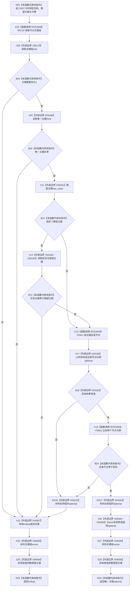

# CF-L11-0126 语素基础数据操作读取唯一主键已许可现状流程图

图类型：现状流程图
代码版本：`03a8b7ac099ccea83e57f2696e2290b7bcdfacaf`
当前工作区复核基线：`9fda64b1f2330996913d09dd314fc498303d3e54`
源码 blob：`ccde9a574e3817b75e3d02c9c8f88e244327c06a`
覆盖文件：`海中鱼巣/领域/数据操作.语素基础.ixx:543-554`
唯一根函数：R0773
完整签名：`std::optional<std::uint64_t> 海中鱼巣::语素基础数据操作::读取唯一主键_已许可(节点句柄 目标, std::optional<std::uint64_t> 期望主键, const 结构事务令牌& 令牌) const`
参数：目标节点句柄、可选期望主键与已许可结构事务令牌
返回结果：仅当目标恰有一个非零主键、可选期望主键匹配且主键反查仍指向目标时返回该主键，否则返回 nullopt
调用图：`流程图/主程序可达调用关系/00_main可达函数身份表.md`、`01_main可达项目调用边表.md`、`02_main可达外部边界表.md`
已登记调用方：R0774（RCE2652）
直接项目函数：R0723（RCE2648）、F0441（RCE2649）、F0051（RCE3332；optional 不等比较双方有值时的底层相等运算）
外部边界：X03179、X03180、X03181、X03182、X03183、X04934、X04935、X04936、X04937
结构读写：只读索引中的节点主键组和主键反查，不修改仓库
逐行映射表：`流程图/代码流程图/L11/CF-L11-0126_语素基础数据操作读取唯一主键已许可_逐行代码映射表.md`
不得作为施工许可：是
不得宣称：nullopt 能区分失败原因，或“已许可”令牌由本函数重新验证

## 流程图

## 当前边界

- 行 550 的 `optional<节点句柄>` 不等比较在反查无值时直接判不等；只有反查有值时才经 RCE3332 调用 F0051。返回对象先构造，再逆序析构局部主键组和按值参数。
