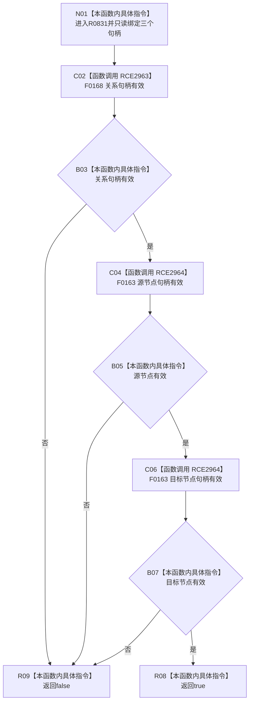

# CF-L11-0128 高级关系证据完整现状流程图

图类型：现状流程图
代码版本：`03a8b7ac099ccea83e57f2696e2290b7bcdfacaf`
当前工作区复核基线：`9fda64b1f2330996913d09dd314fc498303d3e54`
源码 blob：`16ac9534baeda26ac8a712066e713f3339f6e0c8`
覆盖文件：`海中鱼巣/领域/数据操作.需求任务方法.ixx:94-96`
唯一根函数：R0831
完整签名：`bool 海中鱼巣::高级关系证据::完整() const noexcept`
参数：无显式参数；只读关系、源节点与目标节点句柄
返回结果：三个句柄均有效时返回 true，否则 false
调用图：`流程图/主程序可达调用关系/00_main可达函数身份表.md`、`01_main可达项目调用边表.md`、`02_main可达外部边界表.md`
已登记调用方：R0830、R0846
直接项目函数：F0168（RCE2963）、F0163（RCE2964，两次）
外部边界：无
逐行映射表：`流程图/代码流程图/L11/CF-L11-0128_高级关系证据完整_逐行代码映射表.md`
输入契约 / 调用语境表：本图内嵌审查；调用方查询高级关系证据形态完整性
非成功返回二分审查表：本图内嵌审查；false 为任一句柄无效分类
偏差清单：无独立文件；本批只记录当前代码事实
依据提交 / 结构化消息：冻结源码提交 `03a8b7ac099ccea83e57f2696e2290b7bcdfacaf`、正式图谱与顶层稳定 ID 裁决
验证输出：Mermaid / 节点集合 / 逐行覆盖 PASS；目标 no-index 检查 PASS；未构建、未运行
不得作为施工许可：是
不得宣称：句柄完整已经证明关系记录当前有效或业务正确

## 流程图

## 当前边界

- 本函数只核对句柄形态，不检查关系类型、顺序号或记录状态。
