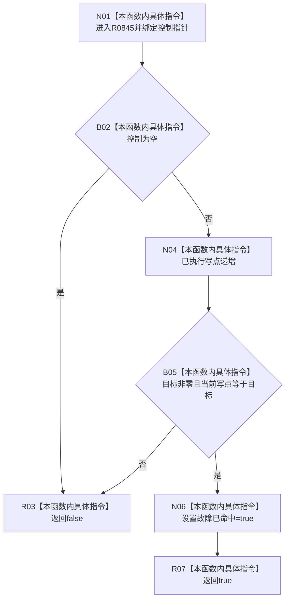

# CF-L11-0129 命中固定故障现状流程图

图类型：现状流程图
代码版本：`03a8b7ac099ccea83e57f2696e2290b7bcdfacaf`
当前工作区复核基线：`4e0ac10ae3b18404ff2b623faa0fb006fa0fc7a1`
源码 blob：`16ac9534baeda26ac8a712066e713f3339f6e0c8`
覆盖文件：`海中鱼巣/领域/数据操作.需求任务方法.ixx:1878-1885`
唯一根函数：R0845
完整签名：`static bool 海中鱼巣::需求任务方法数据操作::命中固定故障(固定故障控制* 控制) noexcept`
参数：可空固定故障控制指针；非拥有借用，仅在调用期间有效
返回结果：空控制或未到目标写点时返回 false；首次到达目标写点时记录命中并返回 true
调用图：`流程图/主程序可达调用关系/00_main可达函数身份表.md`、`01_main可达项目调用边表.md`、`02_main可达外部边界表.md`
已登记调用方：R0451、R0452
直接项目函数：无
外部边界：无
逐行映射表：`流程图/代码流程图/L11/CF-L11-0129_命中固定故障_逐行代码映射表.md`
不得作为施工许可：是
不得宣称：故障命中证明生产事务失败或已完成回滚验证

## 流程图

## 当前边界

- 本函数只在故障自检宏启用时编译并由具名故障路径调用。
