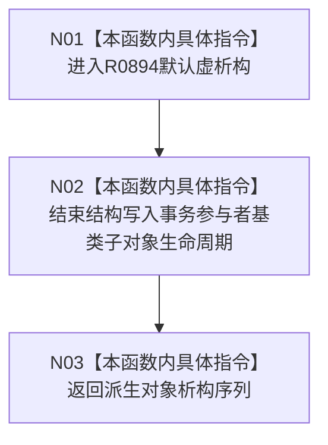

# CF-L11-0130 结构写入事务参与者析构现状流程图

图类型：现状流程图
代码版本：`03a8b7ac099ccea83e57f2696e2290b7bcdfacaf`
当前工作区复核基线：`00d917a5cf09998d2ab14d9239e1c194b5593ff0`
源码 blob：`292e602cef1dd658ac2b507a3cc9ced7270a4a86`
覆盖文件：`海中鱼巣/核心/执行器.结构写入.ixx:26-26`
唯一根函数：R0894
完整签名：`virtual 海中鱼巣::结构写入事务参与者::~结构写入事务参与者()`
参数：无显式参数；析构当前结构写入事务参与者基类子对象
返回结果：无返回值；执行编译器生成的默认虚析构并结束基类子对象生命周期
调用图：正式 main 可达关系表
已登记调用方：R0799（RCE3331，派生析构后的隐式基类析构）
直接项目函数：无
外部边界：无
逐行映射表：`流程图/代码流程图/L11/CF-L11-0130_结构写入事务参与者析构_逐行代码映射表.md`
不得作为施工许可：是
不得宣称：析构完成证明结构写入事务已提交、发布或撤销

## 流程图

## 当前边界

- 基类本身没有数据成员，默认析构不调用准备、确认、发布或撤销虚接口。
