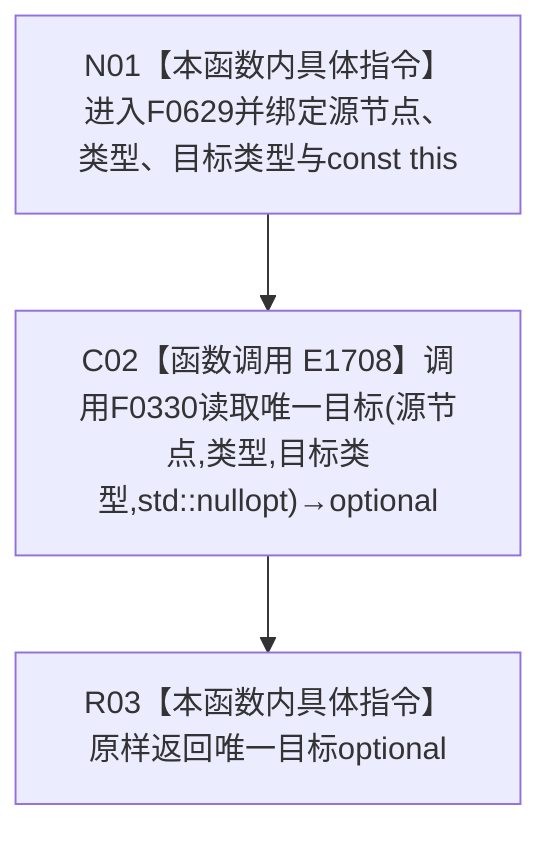

# CF-L12-0001 方法服务读取唯一目标现状流程图

图类型：现状流程图
代码版本：`3920a74638264f9f539d50f32f3c9fe5fb1982ab`
源码 blob：`839dd462c70e8d54b6f22f1126d751ac9425398a`
覆盖文件：`海中鱼巣/领域/方法服务.h:1707-1710`
唯一根函数：F0629
完整签名：`std::optional<海中鱼巣::节点句柄> 海中鱼巣::方法服务::读取唯一目标(海中鱼巣::节点句柄 源节点, 海中鱼巣::关系类型 类型, 海中鱼巣::节点类型 目标类型) const`
参数：源节点、关系类型、目标节点类型按值传入；隐式 const `this` 为调用期间有效的非拥有借用
返回结果：把四参数重载返回的唯一目标 `optional` 原样返回
已登记调用方：R0476、R0480、R0481、R0489、R0492、R0493
直接项目函数：E1708→F0330 四参数 `读取唯一目标`
外部边界：无
未解析项目调用：0
调用图：`流程图/主程序可达调用关系/01_main可达项目调用边表.md`
逐行映射表：`流程图/代码流程图/L12/CF-L12-0001_方法服务读取唯一目标_逐行代码映射表.md`
偏差清单：无；本文只冻结当前转发重载事实
依据提交 / 结构化消息：当前源码、E1708 与函数身份表交叉复核
结构读取与写入：由 F0330 决定读取范围；本函数不直接修改结构
逻辑内返回：F0330 返回空 `optional` 时原样返回
内部错误：异常不转换
生命周期与资源释放：只传递按值参数和 `std::nullopt`，不保留借用
异常：F0330 的异常直接传播
并发 / 幂等：继承 F0330 的只读并发语义
验证输出：1707—1710 行完整映射；1 个项目出边 ID、0 个外部边界、0 个未解析调用
不得作为施工许可：是
不得宣称：空 `optional` 唯一证明目标不存在或本重载执行了独立筛选

## 流程图

## 项目源码调用合同

| 调用边 | 被调函数 | 实参 / 条件 | 结果用途 |
| --- | --- | --- | --- |
| E1708 | F0330 四参数 `读取唯一目标` | `this=&方法服务`；源节点、类型、目标类型、`std::nullopt` | 返回值直接作为 F0629 返回结果 |

## 当前边界

- 本函数只固定“未指定顺序号”的转发合同，不重复展开 F0330 的筛选过程。
- F0330 已有独立函数身份；其非平凡内部过程由自己的现状图承载。
