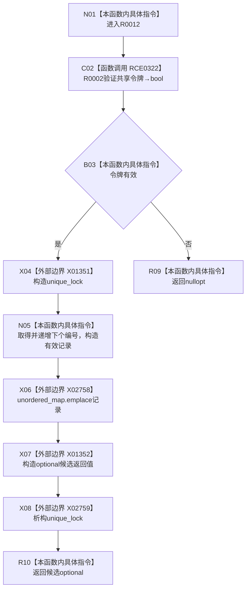

# CF-L12-0002 主信息仓库创建主信息未发布候选现状流程图

图类型：现状流程图
代码版本：`3920a74638264f9f539d50f32f3c9fe5fb1982ab`
源码 blob：`11f8fa53ff961a8cbaac34cf75b69a22533ca907`
覆盖文件：`海中鱼巣/核心/主信息仓库.cpp:80-88`
唯一根函数：R0012
完整签名：`std::optional<主信息未发布候选> 海中鱼巣::主信息仓库::创建主信息未发布候选(const 结构事务令牌& 令牌)`
参数：令牌为 const 借用；隐式 `this` 为借用
返回结果：共享令牌无效返回空 optional；否则创建记录并返回未发布候选
已登记调用方：R0011
直接项目函数：RCE0322→R0002
外部边界：X01351—X01352、X02758—X02759；未解析项目调用：0
调用图：`流程图/主程序可达调用关系/01_main可达项目调用边表.md`
逐行映射表：`流程图/代码流程图/L12/CF-L12-0002_主信息仓库创建主信息未发布候选_逐行代码映射表.md`
偏差清单：无
依据提交 / 结构化消息：当前源码及上述稳定 ID
结构读取与写入：递增编号并向主信息表插入有效记录
逻辑内返回：令牌无效返回 `nullopt`
验证输出：80—88 行完整映射
不得作为施工许可：是
不得宣称：候选已经发布

## 流程图

