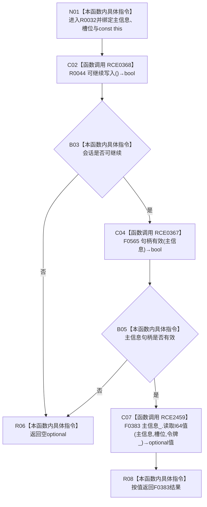

# CF-L12-0003 结构写入会话读取I64值现状流程图

图类型：现状流程图
代码版本：`3920a74638264f9f539d50f32f3c9fe5fb1982ab`
源码 blob：`df70de9c299c74f7f0766a3e94facaf504f57968`
覆盖文件：`海中鱼巣/核心/会话.结构写入.ixx:536-539`
唯一根函数：R0032
完整签名：`std::optional<std::int64_t> 海中鱼巣::结构写入会话::读取I64值(海中鱼巣::主信息句柄 主信息, std::uint64_t 槽位) const`
参数：主信息句柄与槽位按值传入；隐式 const `this` 为非拥有借用
返回结果：会话不可继续或主信息句柄无效时返回空 optional；否则以会话令牌委托 F0383 读取指定槽位并原样返回
已登记调用方：R0457 经 RCE1420
直接项目函数：RCE0368→R0044、校正后 RCE0367→F0565、RCE2459→F0383
外部边界：无
未解析项目调用：0
调用图：`流程图/主程序可达调用关系/01_main可达项目调用边表.md`
逐行映射表：`流程图/代码流程图/L12/CF-L12-0003_结构写入会话读取I64值_逐行代码映射表.md`
偏差清单：RCE0367 已从错误的关系句柄重载 F0168 校正到主信息句柄重载 F0565
结构读取与写入：只读主信息指定值槽；零机器事实写入
逻辑内返回：入口门禁失败或 F0383 返回空 optional
内部错误：强前置已保证值存在且可读却返回空时追查会话、令牌或主信息仓库
生命周期与资源释放：optional 按值返回；不保存句柄或令牌借用
异常：被调判断或读取异常直接传播
并发 / 幂等：使用已有会话令牌读取；同一冻结状态下幂等
验证输出：536—539 行完整映射；1 条项目入边、3 条项目出边、0 个外部边界、0 个未解析调用
不得作为施工许可：是
不得宣称：空 optional 唯一表示槽位无值、读回值在函数后持续当前或本函数写入了值

## 流程图

## 当前边界

- 第 537 行按 `||` 短路；会话不可继续时不调用 F0565。
- RCE0367 的静态实参是主信息句柄，不是关系句柄。
- 本函数不解释槽位业务语义，只委托带令牌读取。
