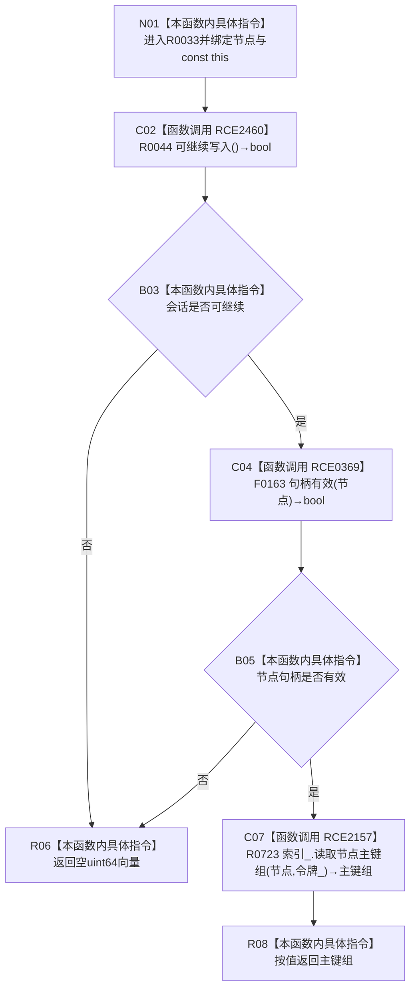

# CF-L12-0004 结构写入会话读取节点主键组现状流程图

图类型：现状流程图
代码版本：`3920a74638264f9f539d50f32f3c9fe5fb1982ab`
源码 blob：`df70de9c299c74f7f0766a3e94facaf504f57968`
覆盖文件：`海中鱼巣/核心/会话.结构写入.ixx:541-544`
唯一根函数：R0033
完整签名：`std::vector<std::uint64_t> 海中鱼巣::结构写入会话::读取节点主键组(海中鱼巣::节点句柄 节点) const`
参数：节点句柄按值传入；隐式 const `this` 为非拥有借用
返回结果：会话不可继续或节点句柄无效时返回空向量；否则以会话令牌委托索引仓库读取节点主键组并原样返回
已登记调用方：R0414 经 RCE1294
直接项目函数：RCE2460→R0044、RCE0369→F0163、RCE2157→R0723
外部边界：无
未解析项目调用：0
调用图：`流程图/主程序可达调用关系/01_main可达项目调用边表.md`
逐行映射表：`流程图/代码流程图/L12/CF-L12-0004_结构写入会话读取节点主键组_逐行代码映射表.md`
偏差清单：无
结构读取与写入：只读索引仓库节点主键组；零机器事实写入
逻辑内返回：入口门禁失败或索引仓库返回空组
内部错误：强前置已保证应有主键却返回空时由调用方追查
生命周期与资源释放：向量按值返回；不保存节点或令牌借用
异常：被调读取或向量构造异常直接传播
并发 / 幂等：使用会话令牌读取；同一冻结状态下幂等
验证输出：541—544 行完整映射；1 条项目入边、3 条项目出边、0 个外部边界、0 个未解析调用
不得作为施工许可：是
不得宣称：空向量唯一表示节点未绑定主键、返回组持续当前或本函数拥有索引

## 流程图

## 当前边界

- 第 542 行按 `||` 短路；会话不可继续时不调用 F0163。
- R0723 使用现有会话令牌读取索引。
- 返回向量不区分入口拒绝与合法空主键组。
