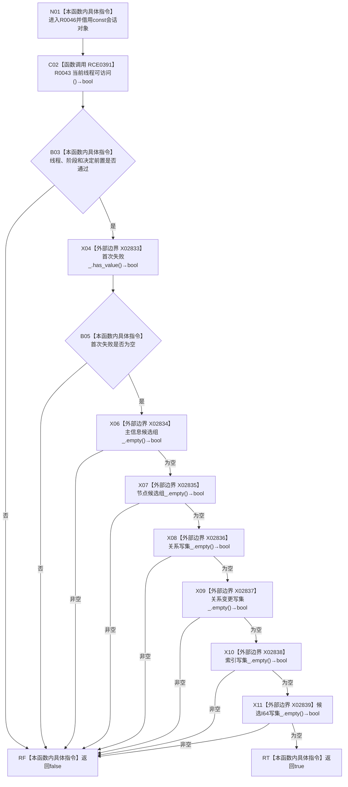

# CF-L12-0005 结构写入会话可查询写前材料现状流程图

图类型：现状流程图
代码版本：`64a2d63eca4a76b7282f3f8807aa6fea5b0f66a1`
源码事实提交：`3920a74638264f9f539d50f32f3c9fe5fb1982ab`
源码 blob：`df70de9c299c74f7f0766a3e94facaf504f57968`
覆盖文件：`海中鱼巣/核心/会话.结构写入.ixx:742-747`
唯一根函数：R0046
完整签名：`bool 海中鱼巣::结构写入会话::可查询写前材料() const`
参数：无显式参数；隐式 `this` 为 const 非拥有借用
返回结果：线程、阶段、决定、首次失败和六类会话写集全部满足写前查询条件时返回 true，否则返回 false
已登记调用方：R0063 经 RCE0419
直接项目函数：RCE0391→R0043
外部边界：X02833—X02839
未解析项目调用：0
逐行映射表：`流程图/代码流程图/L12/CF-L12-0005_结构写入会话可查询写前材料_逐行代码映射表.md`
结构读取与写入：只读线程、阶段、决定、首次失败和六类写集是否为空，零结构变化
验证输出：742—747 行完整映射；1 条项目入边、1 条项目出边、7 个外部边界
不得作为施工许可：是
不得宣称：返回 true 证明仓库中不存在结构，或写前查询材料已经形成

## 流程图

## 当前边界

- RCE0391 实参为 `this=this`，返回 bool 是短路合取的第一项；随后还要求阶段为写入中、决定未形成。
- X02833 对应首次失败 optional；X02834—X02839 按源码顺序对应六类 vector 的 `empty()` 只读查询。
