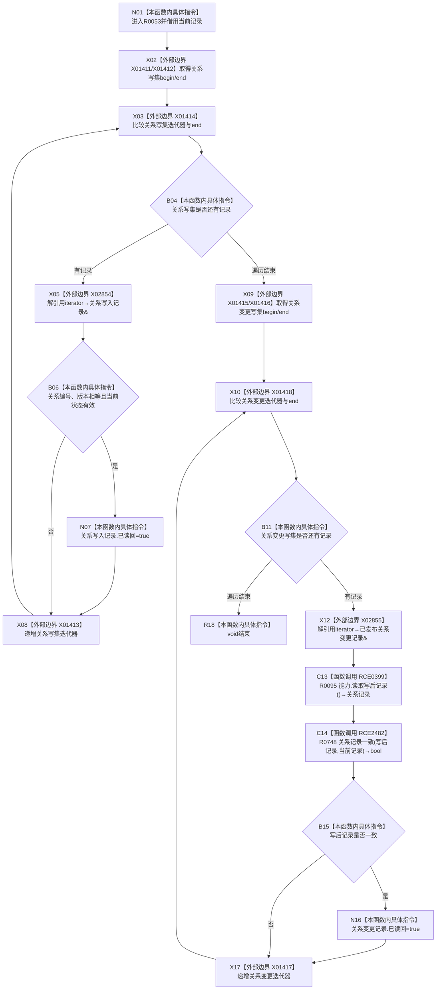

# CF-L12-0006 结构写入会话标记关系审计已读回现状流程图

图类型：现状流程图
代码版本：`176b674a6c1499ccdd7306f30f910fec6dc5079c`
源码 blob：`df70de9c299c74f7f0766a3e94facaf504f57968`
覆盖文件：`海中鱼巣/核心/会话.结构写入.ixx:798-811`
唯一根函数：R0053
完整签名：`void 海中鱼巣::结构写入会话::标记关系审计已读回(const 海中鱼巣::关系记录& 当前记录) const`
参数：当前记录为只读借用；const `this` 为借用，两个关系写集为 `mutable`
返回结果：`void`；把编号、版本及状态匹配的关系写入记录或写后记录标为已读回
已登记调用方：R0025 经 RCE0349；R0026 经 RCE0352
直接项目函数：RCE0399→R0095；RCE2482→R0748
被调身份内部边界：R0748 经 RCE2483 在源码 791、792 行两次调用 F0051；本轮遵令不单独绘制 R0748
外部边界：X01411—X01418；X02854、X02855
未解析项目调用：0
调用图：`流程图/主程序可达调用关系/01_main可达项目调用边表.md`
逐行映射表：`流程图/代码流程图/L12/CF-L12-0006_结构写入会话标记关系审计已读回_逐行代码映射表.md`
偏差清单：无；R0748 及其 RCE2483 内部边只作被调身份边界，不混入 R0053 执行节点
结构读取与写入：读取当前关系审计材料；匹配时写两个会话内 `已读回` 标志
逻辑内返回：任一写集为空或无匹配记录时正常 `void` 结束
验证输出：798—811 行完整映射；不得作为施工许可：是
不得宣称：已读回标记证明关系事务已提交或发布

## 流程图

