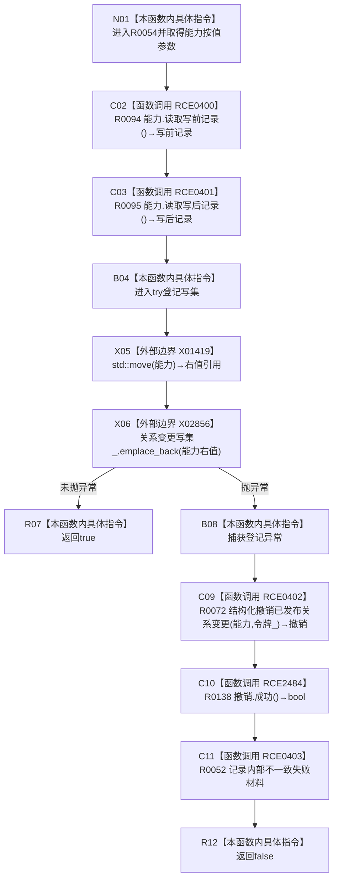

# CF-L12-0007 结构写入会话登记关系变更能力现状流程图

图类型：现状流程图
代码版本：`176b674a6c1499ccdd7306f30f910fec6dc5079c`
源码 blob：`df70de9c299c74f7f0766a3e94facaf504f57968`
覆盖文件：`海中鱼巣/核心/会话.结构写入.ixx:813-828`
唯一根函数：R0054
完整签名：`bool 海中鱼巣::结构写入会话::登记关系变更能力(海中鱼巣::已发布关系变更能力 能力)`
参数：能力按值传入，成功时移动到关系变更写集；`this` 为可修改借用
返回结果：登记成功返回 true；容器登记抛异常时尝试撤销、记录内部不一致并返回 false
已登记调用方：R0024 经 RCE0345
直接项目函数：RCE0400→R0094；RCE0401→R0095；RCE0402→R0072；RCE0403→R0052；RCE2484→R0138
外部边界：X01419 `std::move`；X02856 `emplace_back`
未解析项目调用：0
调用图：`流程图/主程序可达调用关系/01_main可达项目调用边表.md`
逐行映射表：`流程图/代码流程图/L12/CF-L12-0007_结构写入会话登记关系变更能力_逐行代码映射表.md`
偏差清单：成功移动后写集拥有能力；异常分支以源码中的参数状态执行撤销
结构读取与写入：读取写前/写后关系；成功新增写集记录；异常时调用关系仓库撤销并写首次失败
逻辑内返回：容器登记成功为 true；异常收口为 false
验证输出：813—828 行完整映射；不得作为施工许可：是
不得宣称：返回 true 证明关系变更已经确认或发布

## 流程图

