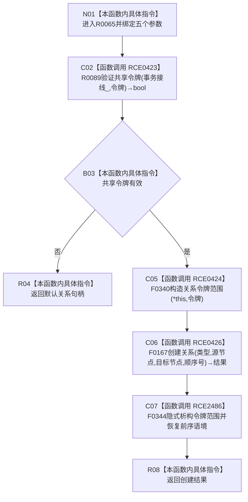

# CF-L12-0008 关系仓库创建关系令牌重载现状流程图

图类型：现状流程图
代码版本：`176b674a6c1499ccdd7306f30f910fec6dc5079c`
源码 blob：`f7a9ea9a09d3065468208c16f9ea34f806b6e183`
覆盖文件：`海中鱼巣/核心/关系仓库.cpp:1031-1034`
唯一根函数：R0065
完整签名：`关系句柄 海中鱼巣::关系仓库::创建关系(关系类型 类型, 节点句柄 源节点, 节点句柄 目标节点, std::int64_t 顺序号, const 结构事务令牌& 令牌)`
参数：类型、源节点、目标节点、顺序号按值；令牌为只读借用；`this` 为可修改借用
返回结果：共享令牌无效时返回默认关系句柄；有效时返回无令牌重载的创建结果
直接项目函数：RCE0423→R0089；RCE0424→F0340；RCE0426→F0167；RCE2486→F0344（隐式析构）
已登记调用方：RCE0431（R0066→R0065）
外部边界：无；未解析调用：0
调用图：`流程图/主程序可达调用关系/01_main可达项目调用边表.md`
逐行映射表：`流程图/代码流程图/L12/CF-L12-0008_关系仓库创建关系令牌重载_逐行代码映射表.md`
输入契约 / 调用语境表：本图 B03；非成功返回二分审查表：R04
偏差清单：无；依据提交 / 结构化消息：当前源码、RCE0423、RCE0424、RCE0426、RCE2486
验证输出：1031—1034 行及宏展开完整映射；不得作为施工许可：是
不得宣称：返回非默认句柄之外的状态语义，或令牌范围构造等于关系创建成功

## 流程图

