# CF-L12-0009 关系仓库结构化挂载或重挂节点现状流程图

图类型：现状流程图
代码版本：`176b674a6c1499ccdd7306f30f910fec6dc5079c`
源码 blob：`f7a9ea9a09d3065468208c16f9ea34f806b6e183`
覆盖文件：`海中鱼巣/核心/关系仓库.cpp:1215-1363`
唯一根函数：R0068
完整签名：`结构化节点挂载结果 海中鱼巣::关系仓库::结构化挂载或重挂节点(节点句柄 节点, 节点句柄 新父节点, const 结构事务令牌& 令牌)`
参数：节点、新父节点按值；令牌为只读借用；`this` 为可修改借用
返回结果：许可拒绝、无效端点、拒绝自身、拒绝成环、内部不一致、已在目标父、已创建或已重挂的结构化挂载结果
直接项目函数：RCE0433→R0091；RCE0434→F0630；RCE0435→F0051；RCE0436→R0086；RCE0437→R0087；RCE0438→R0069；RCE0439→F0184；RCE0440→R0067；RCE0441→R0064；RCE0442→R0096；RCE0443→R0080；RCE0444→R0093
已登记调用方：RCE0342（R0024→R0068）
外部边界：X01488—X01496、X01498、X02873—X02892；X01495 / X01496 按 `unordered_map<std::uint64_t, 关系记录>::iterator` 静态类型解释
已停用边界：X01497（项目构造调用已由 RCE0442 覆盖，不是当前外部边界）；未解析调用：0
调用图：`流程图/主程序可达调用关系/01_main可达项目调用边表.md`
逐行映射表：`流程图/代码流程图/L12/CF-L12-0009_关系仓库结构化挂载或重挂节点_逐行代码映射表.md`
输入契约 / 调用语境表：入口许可、端点、写前复核和锁内复核节点；非成功返回二分审查表：R08、R12、R15、R35、各内部不一致分支与拒绝成环分支
偏差清单：RCE0441 语义校正为“新建关系 `emplace` 成功后比较已插入记录与本地构造记录”；X01497 已停用
依据提交 / 结构化消息：当前源码、稳定项目边、校正后的外部边界集合
验证输出：1215—1363 行完整映射；不得作为施工许可：是
不得宣称：返回已提交等于外层事务已发布，或诊断调用自身改变机器事实

## 流程图

```mermaid
flowchart TD
 N01["N01【本函数内具体指令】进入R0068并默认构造输出"]
 N02["N02【本函数内具体指令】操作默认=入口拒绝"]
 X03["X03【外部边界 X02873】以nullopt构造旧父节点optional"]
 X04["X04【外部边界 X02874】以nullopt构造父关系optional"]
 N05["N05【本函数内具体指令】挂载默认=无效端点"]
 C06["C06【函数调用 RCE0433】R0091验证独占令牌(事务接线_,令牌)→bool"]
 B07{"B07【本函数内具体指令】独占令牌有效"}
 R08["R08【本函数内具体指令】操作=许可拒绝并返回"]
 C09["C09【函数调用 RCE0434】F0630节点是否有效(节点,令牌)"]
 C10["C10【函数调用 RCE0434】F0630节点是否有效(新父节点,令牌)"]
 B11{"B11【本函数内具体指令】两个端点都有效"}
 R12["R12【本函数内具体指令】返回无效端点结果"]
 C13["C13【函数调用 RCE0435】F0051比较节点与新父节点"]
 B14{"B14【本函数内具体指令】节点==新父节点"}
 R15["R15【本函数内具体指令】挂载=拒绝自身并返回"]
 N16["N16【本函数内具体指令】初始化写前父关系、父链结果与父链节点组"]
 X17["X17【外部边界 X01488】构造shared_lock(仓库锁_)"]
 C18["C18【函数调用 RCE0436】R0086复核普通父关系_已加锁(节点)"]
 C19["C19【函数调用 RCE0437】R0087复核父链_已加锁(新父节点,节点,&父链组)"]
 X20["X20【外部边界 X02875】销毁shared_lock并释放共享锁"]
 X21["X21【外部边界 X02879】写前父节点.has_value()"]
 B22{"B22【本函数内具体指令】写前父节点存在"}
 X23["X23【外部边界 X02880】写前父节点.value()→节点句柄引用"]
 C24["C24【函数调用 RCE0434】F0630节点是否有效(写前父节点,令牌)"]
 N25["N25【本函数内具体指令】形成写前父关系端点有效标志"]
 X26["X26【外部边界 X02877】写前父链节点组.begin()"]
 X27["X27【外部边界 X02878】写前父链节点组.end()"]
 X28["X28【外部边界 X01489】std::all_of(父链范围,R0069)"]
 C29["C29【函数调用 RCE0438】R0069逐项父链节点检查回调→bool"]
 B30{"B30【本函数内具体指令】写前父关系、父链与端点全部一致"}
 N31["N31【本函数内具体指令】操作/挂载=内部不一致"]
 X32["X32【外部边界 X01490】输出.旧父节点=写前父节点optional"]
 C33["C33【函数调用 RCE0439】F0184追根因检查(false,写前结构诊断)"]
 X34["X34【外部边界 X02876】销毁写前父链节点组vector"]
 R35["R35【本函数内具体指令】返回写前内部不一致结果"]
 X36["X36【外部边界 X01491】构造unique_lock(仓库锁_)"]
 C37["C37【函数调用 RCE0436】R0086锁内复核当前普通父关系"]
 C38["C38【函数调用 RCE0437】R0087锁内复核当前父链"]
 X39["X39【外部边界 X01492】输出.旧父节点=当前父节点optional"]
 B40{"B40【本函数内具体指令】锁内父关系或父链结构不一致"}
 N41["N41【本函数内具体指令】操作/挂载=内部不一致"]
 X42["X42【外部边界 X01494】由新父节点构造optional"]
 X43["X43【外部边界 X01493】比较当前父节点optional与新父节点optional"]
 C44["C44【函数调用 RCE0435】F0051比较optional内节点句柄"]
 B45{"B45【本函数内具体指令】当前父节点就是新父节点"}
 X46["X46【外部边界 X02882】当前关系编号.has_value()"]
 B47{"B47【本函数内具体指令】父链含目标或关系编号缺失"}
 N48["N48【本函数内具体指令】操作/挂载=内部不一致"]
 X49["X49【外部边界 X02883】当前关系编号.value()"]
 X50["X50【外部边界 X02885】关系表_.find(关系编号)→位置"]
 X51["X51【外部边界 X02886】关系表_.end()"]
 X52["X52【外部边界 X01495】unordered_map::iterator比较位置与end"]
 X53["X53【外部边界 X02887】读取位置记录状态/类型/源/目标"]
 C54["C54【函数调用 RCE0435】F0051比较记录端点句柄"]
 B55{"B55【本函数内具体指令】幂等关系记录有效且端点匹配"}
 N56["N56【本函数内具体指令】操作/挂载=内部不一致"]
 X57["X57【外部边界 X02887】读取位置记录"]
 C58["C58【函数调用 RCE0440】R0067形成关系句柄(仓库编号_,记录)"]
 N59["N59【本函数内具体指令】形成幂等读回/已在目标父结果"]
 X60["X60【外部边界 X02884】父关系.emplace(当前句柄)"]
 B61{"B61【本函数内具体指令】父链结果==包含目标"}
 N62["N62【本函数内具体指令】挂载=拒绝成环"]
 X63["X63【外部边界 X02882】当前关系编号.has_value()"]
 B64{"B64【本函数内具体指令】当前关系编号存在"}
 B65{"B65【本函数内具体指令】下个关系编号_==0"}
 X66["X66【外部边界 X02889】numeric_limits<uint64_t>::max()"]
 B67{"B67【本函数内具体指令】下个关系编号已达最大值"}
 N68["N68【本函数内具体指令】操作/挂载=内部不一致"]
 N69["N69【本函数内具体指令】分配编号并构造普通父子关系记录"]
 X70["X70【外部边界 X02888】关系表_.emplace(编号,记录)→插入结果"]
 B71{"B71【本函数内具体指令】插入结果.second"}
 X72["X72【外部边界 X02887】读取插入结果.first->second"]
 C73["C73【函数调用 RCE0441】R0064比较已插入记录与本地记录"]
 B74{"B74【本函数内具体指令】插入记录一致"}
 N75["N75【本函数内具体指令】操作/挂载=内部不一致"]
 C76["C76【函数调用 RCE0440】R0067形成新建关系句柄"]
 N77["N77【本函数内具体指令】形成已提交/已创建结果"]
 X78["X78【外部边界 X02884】父关系.emplace(当前句柄)"]
 X79["X79【外部边界 X02883】当前关系编号.value()"]
 X80["X80【外部边界 X02885】关系表_.find(关系编号)→位置"]
 X81["X81【外部边界 X02886】关系表_.end()"]
 X82["X82【外部边界 X01496】unordered_map::iterator比较位置与end"]
 X83["X83【外部边界 X02887】读取位置记录状态/类型/目标/源/版本"]
 X84["X84【外部边界 X02879】当前父节点.has_value()"]
 X85["X85【外部边界 X02881】当前父节点.value()→const节点句柄引用"]
 X86["X86【外部边界 X02890】numeric_limits<uint32_t>::max()"]
 C87["C87【函数调用 RCE0435】F0051比较记录目标与节点、记录源与旧父节点"]
 B88{"B88【本函数内具体指令】现有关系记录可重挂"}
 N89["N89【本函数内具体指令】操作/挂载=内部不一致"]
 X90["X90【外部边界 X02887】复制写前记录、改源节点、递增版本并复制写后记录"]
 C91["C91【函数调用 RCE0442】R0096构造已发布关系变更能力"]
 C93["C93【函数调用 RCE0443】R0080能力.处于持有阶段()→bool"]
 X94["X94【外部边界 X02887】失败时恢复位置记录=写前记录"]
 N95["N95【本函数内具体指令】操作/挂载=内部不一致"]
 C96["C96【函数调用 RCE0440】R0067形成重挂后关系句柄"]
 N97["N97【本函数内具体指令】形成已提交/已重挂结果"]
 X98["X98【外部边界 X02884】父关系.emplace(当前句柄)"]
 X99["X99【外部边界 X01498】std::move(能力)"]
 C100["C100【函数调用 RCE0444】R0093移动构造已发布关系变更能力"]
 X101["X101【外部边界 X02891】输出.能力.emplace(移动后能力)"]
 B102{"B102【本函数内具体指令】最终挂载状态==内部不一致"}
 C103["C103【函数调用 RCE0439】F0184追根因检查(false,锁内结构诊断)"]
 X104["X104【外部边界 X02892】销毁unique_lock并释放独占锁"]
 X105["X105【外部边界 X02876】销毁写前父链节点组vector"]
 R106["R106【本函数内具体指令】返回结构化节点挂载结果"]

 N01 --> N02 --> X03 --> X04 --> N05 --> C06 --> B07
 B07 -- "否" --> R08
 B07 -- "是" --> C09 --> C10 --> B11
 B11 -- "否" --> R12
 B11 -- "是" --> C13 --> B14
 B14 -- "是" --> R15
 B14 -- "否" --> N16 --> X17 --> C18 --> C19 --> X20 --> X21 --> B22
 B22 -- "否" --> N25
 B22 -- "是" --> X23 --> C24 --> N25
 N25 --> X26
 N25 --> X27
 X26 --> X28
 X27 --> X28
 X28 --> C29 --> B30
 B30 -- "否" --> N31 --> X32 --> C33 --> X34 --> R35
 B30 -- "是" --> X36 --> C37 --> C38 --> X39 --> B40
 B40 -- "是" --> N41 --> B102
 B40 -- "否" --> X42 --> X43 --> C44 --> B45
 B45 -- "是" --> X46 --> B47
 B47 -- "是" --> N48 --> B102
 B47 -- "否" --> X49 --> X50 --> X51 --> X52 --> X53 --> C54 --> B55
 B55 -- "否" --> N56 --> B102
 B55 -- "是" --> X57 --> C58 --> N59 --> X60 --> B102
 B45 -- "否" --> B61
 B61 -- "是" --> N62 --> B102
 B61 -- "否" --> X63 --> B64
 B64 -- "否" --> B65
 B65 -- "是" --> N68 --> B102
 B65 -- "否" --> X66 --> B67
 B67 -- "是" --> N68
 B67 -- "否" --> N69 --> X70 --> B71
 B71 -- "否" --> N75 --> B102
 B71 -- "是" --> X72 --> C73 --> B74
 B74 -- "否" --> N75
 B74 -- "是" --> C76 --> N77 --> X78 --> B102
 B64 -- "是" --> X79 --> X80 --> X81 --> X82 --> X83 --> X84 --> X85 --> X86 --> C87 --> B88
 B88 -- "否" --> N89 --> B102
 B88 -- "是" --> X90 --> C91 --> C93
 C93 -- "否" --> X94 --> N95 --> B102
 C93 -- "是" --> C96 --> N97 --> X98 --> X99 --> C100 --> X101 --> B102
 B102 -- "是" --> C103 --> X104 --> X105 --> R106
 B102 -- "否" --> X104 --> X105 --> R106
```

