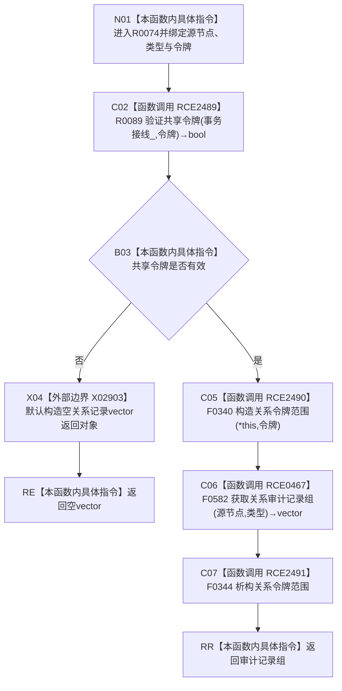

# CF-L12-0010 关系仓库获取关系审计记录组令牌重载现状流程图

图类型：现状流程图
代码版本：`176b674a6c1499ccdd7306f30f910fec6dc5079c`
源码事实提交：`3920a74638264f9f539d50f32f3c9fe5fb1982ab`
源码 blob：`f7a9ea9a09d3065468208c16f9ea34f806b6e183`
覆盖文件：`海中鱼巣/核心/关系仓库.cpp:1438-1441`
唯一根函数：R0074
完整签名：`std::vector<海中鱼巣::关系记录> 海中鱼巣::关系仓库::获取关系审计记录组(海中鱼巣::节点句柄 源节点, 海中鱼巣::关系类型 类型, const 海中鱼巣::结构事务令牌& 令牌) const`
参数：源节点和类型按值传入；令牌为 const 非拥有借用；隐式 `this` 为 const 仓库借用
返回结果：共享令牌无效时返回空向量；有效时在令牌语境中原样返回无令牌审计组重载结果
已登记调用方：R0026，经 RCE0351
直接项目函数：RCE2489→R0089、RCE2490→F0340、RCE0467→F0582、RCE2491→F0344
外部边界：X02903
未解析项目调用：0
逐行映射表：`流程图/代码流程图/L12/CF-L12-0010_关系仓库获取关系审计记录组令牌重载_逐行代码映射表.md`
结构读取与写入：只建立线程局部令牌语境并读取审计记录组，零持久结构变化
验证输出：1438—1441 行完整映射；1 条项目入边、4 条项目出边、1 个外部边界
不得作为施工许可：是

## 流程图

## 当前边界

- X02903 仅在 RCE2489 返回 false 时直接构造空返回向量；本函数内不析构该返回对象。
- RCE2491 覆盖 RCE2490 构造后的正常、返回和异常退出，恢复线程局部前序语境。
