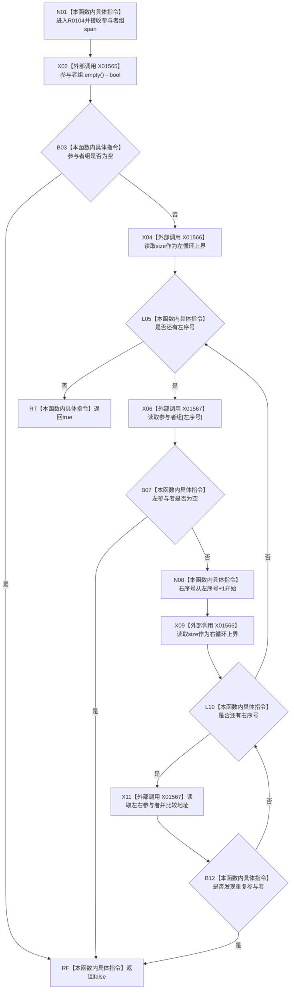

# CF-L12-0011 结构写入执行器有效参与者组现状流程图

图类型：现状流程图
代码版本：`7ad8cf5113162fe92b9f8d43f2b5b9f00d292d1a`
源码事实提交：`3920a74638264f9f539d50f32f3c9fe5fb1982ab`
源码 blob：`292e602cef1dd658ac2b507a3cc9ced7270a4a86`
覆盖文件：`海中鱼巣/核心/执行器.结构写入.ixx:350-360`
唯一根函数：R0104
完整签名：`static bool 海中鱼巣::结构写入执行器::有效参与者组(std::span<结构写入事务参与者* const> 参与者组) noexcept`
参数：`参与者组` 为值式非拥有 span
返回结果：非空、无空指针且无重复地址时返回 true，否则返回 false
已登记调用方：R0102，经 RCE0519
直接项目函数：无
外部边界：X01565 span::empty、X01566 span::size、X01567 span::operator[]
未解析项目调用：0
逐行映射表：`流程图/代码流程图/L12/CF-L12-0011_结构写入执行器有效参与者组_逐行代码映射表.md`
结构读取与写入：只读参与者指针视图，零结构变化
验证输出：350—360 行完整映射；1 条项目入边、0 条项目出边、3 个外部边界
不得作为施工许可：是

## 流程图

## 当前边界

- X01566 在两个循环条件各出现一次；X01567 在空指针判断出现一次、重复比较出现两次。
- 指针只用于空值和地址重复检查，不解引用参与者对象。
