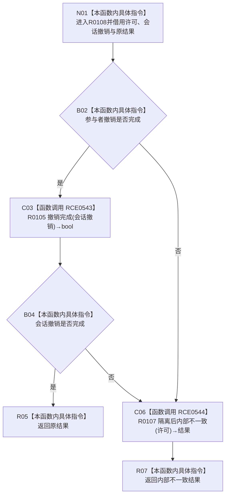

# CF-L12-0012 结构写入执行器汇总撤销结果现状流程图

图类型：现状流程图
代码版本：`7ad8cf5113162fe92b9f8d43f2b5b9f00d292d1a`
源码事实提交：`3920a74638264f9f539d50f32f3c9fe5fb1982ab`
源码 blob：`292e602cef1dd658ac2b507a3cc9ced7270a4a86`
覆盖文件：`海中鱼巣/核心/执行器.结构写入.ixx:377-384`
唯一根函数：R0108
完整签名：`结构写入结果 海中鱼巣::结构写入执行器::汇总撤销结果(const 结构事务许可& 许可, bool 参与者撤销完成, const 结构写入结果& 会话撤销, const 结构写入结果& 原结果) const noexcept`
参数：`许可`、`会话撤销`、`原结果` 为 const 非拥有借用；`参与者撤销完成` 为值式布尔
返回结果：参与者与会话撤销均完成时返回原结果，否则返回隔离后的内部不一致
已登记调用方：R0102，经 RCE0526
直接项目函数：RCE0543→R0105、RCE0544→R0107
外部边界：无
未解析项目调用：0
逐行映射表：`流程图/代码流程图/L12/CF-L12-0012_结构写入执行器汇总撤销结果_逐行代码映射表.md`
结构读取与写入：只读撤销结果；失败分支委托 R0107 请求隔离并形成内部不一致
验证输出：377—384 行完整映射；1 条项目入边、2 条项目出边、0 个外部边界
不得作为施工许可：是

## 流程图

## 当前边界

- `&&` 短路使参与者撤销未完成时不调用 R0105。
- 任一撤销未完成都调用 R0107；本函数不把部分撤销包装成原结果。
