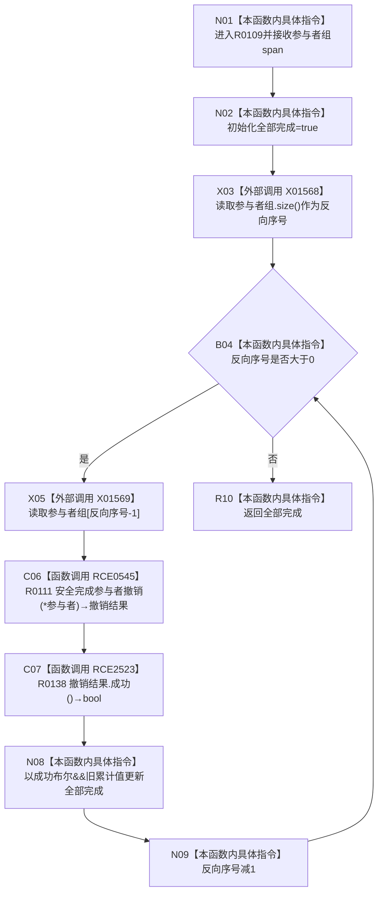

# CF-L12-0013 结构写入执行器逆序完成参与者撤销现状流程图

图类型：现状流程图
代码版本：`73cc1af758e041519fa27c1dd57b9d5d07e3405a`
源码事实提交：`3920a74638264f9f539d50f32f3c9fe5fb1982ab`
源码 blob：`292e602cef1dd658ac2b507a3cc9ced7270a4a86`
覆盖文件：`海中鱼巣/核心/执行器.结构写入.ixx:386-394`
唯一根函数：R0109
完整签名：`static bool 海中鱼巣::结构写入执行器::逆序完成参与者撤销(std::span<海中鱼巣::结构写入事务参与者* const> 参与者组) noexcept`
参数：`参与者组` 为值式非拥有 span；元素为调用方拥有的事务参与者指针
返回结果：全部参与者撤销结果均成功时返回 true；任一失败时返回 false，但仍继续逆序调用剩余参与者
已登记调用方：R0102，经 RCE0524
直接项目函数：RCE0545→R0111；新增稳定 RCE2523→R0138
外部边界：X01568 `span::size()`；X01569 `span::operator[]`
未解析项目调用：0
逐行映射表：`流程图/代码流程图/L12/CF-L12-0013_结构写入执行器逆序完成参与者撤销_逐行代码映射表.md`
结构读取与写入：本函数只聚合布尔结果；参与者撤销变化由 R0111/R0263 后继负责
验证输出：386—394 行完整映射；1 条项目入边、2 条项目出边、2 个当前外部边界
不得作为施工许可：是

## 流程图

## 当前边界

- RCE0545 的当前可达模板实例静态参数为 `结构写入事务参与者`，虚目标由 R0111 后继精确解析。
- RCE2523 先求值 `撤销结果.成功()`；结果为 false 时 `&&` 短路，不读取旧累计值，但循环不会提前退出。
- X01568 只在循环初始化时读取一次长度；X01569 每轮使用 `反向序号-1`，形成从末尾到首项的顺序。
