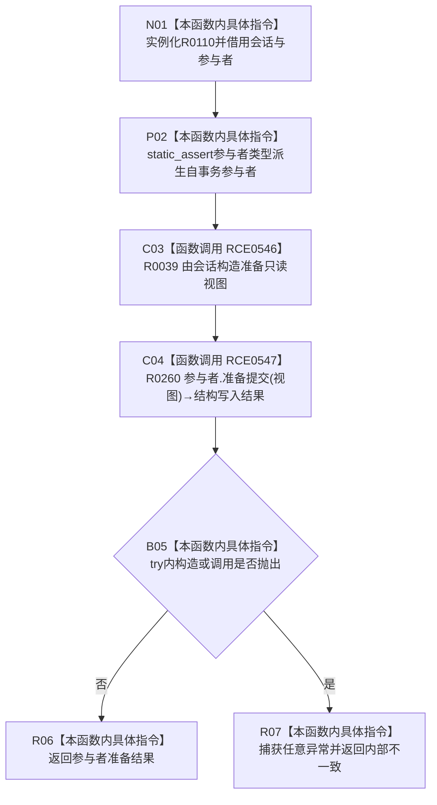

# CF-L12-0014 结构写入执行器安全准备参与者现状流程图

图类型：现状流程图
代码版本：`73cc1af758e041519fa27c1dd57b9d5d07e3405a`
源码事实提交：`3920a74638264f9f539d50f32f3c9fe5fb1982ab`
源码 blob：`292e602cef1dd658ac2b507a3cc9ced7270a4a86`
覆盖文件：`海中鱼巣/核心/执行器.结构写入.ixx:396-407`
唯一根函数：R0110
完整签名：`template <typename 参与者类型> static 海中鱼巣::结构写入结果 海中鱼巣::结构写入执行器::安全准备参与者(const 海中鱼巣::结构写入会话& 会话, 参与者类型& 参与者) noexcept`
参数：`会话` 为 const 非拥有借用；`参与者` 为非拥有可写引用；当前可达实例的类型为 `结构写入事务参与者`
返回结果：返回 R0260 的准备结果；任意异常被折叠为 `内部不一致`
已登记调用方：R0102，经 RCE0532
直接项目函数：RCE0546→R0039；RCE0547→R0260
外部边界：无
未解析项目调用：0
逐行映射表：`流程图/代码流程图/L12/CF-L12-0014_结构写入执行器安全准备参与者_逐行代码映射表.md`
结构读取与写入：构造只读准备视图并委托当前唯一可达参与者实现准备提交
验证输出：396—407 行完整映射；1 条项目入边、2 条项目出边、0 个外部边界
不得作为施工许可：是

## 流程图

## 当前边界

- 当前唯一可达真实参与者为 `特征值原始材料事务参与者`；RCE0547 已解析到其 R0260，不登记其它不可达虚目标。
- 本函数为 `noexcept`，R0039 构造或 R0260 调用抛出的任意异常均在本函数内折叠为值式 `内部不一致`。
