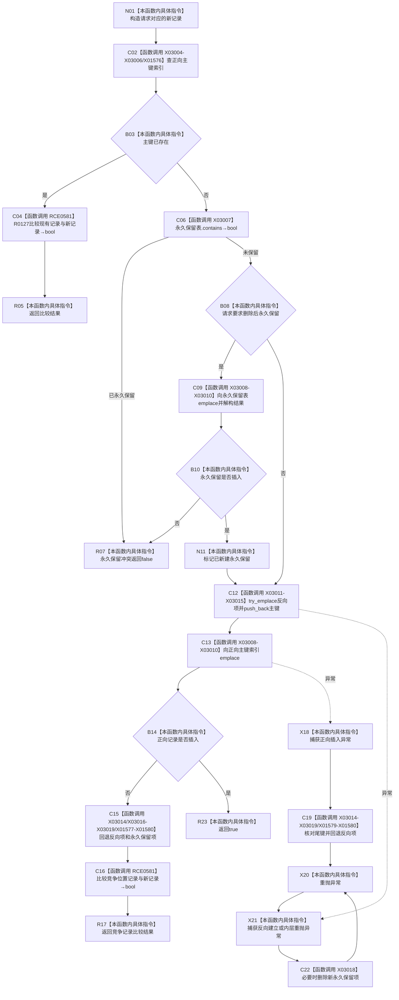

# CF-L12-0017 索引仓库绑定主键已加锁现状流程图

图类型：现状流程图
代码版本：`3920a74638264f9f539d50f32f3c9fe5fb1982ab`
源码 blob：`8874312f67f19b220a08b1397c6103396878513d`
覆盖文件：`海中鱼巣/核心/索引仓库.cpp:26-66`
唯一根函数：R0122
完整签名：`bool 海中鱼巣::{匿名命名空间@索引仓库.cpp}::绑定主键_已加锁(std::unordered_map<std::uint64_t,海中鱼巣::主键绑定记录>& 主键索引, std::unordered_map<std::uint64_t,std::vector<std::uint64_t>>& 节点主键组, std::unordered_map<std::uint64_t,海中鱼巣::主键绑定记录>& 永久保留主键组, const 海中鱼巣::索引绑定请求& 请求)`
参数：三张表为调用方已持锁的可写借用；请求为 const 非拥有借用
返回结果：已有完全相同记录或新建完整正反绑定时为 `true`；冲突/永久保留/插入不一致为 `false`；资源异常清理后重抛
已登记调用方：RCE0576（R0119）
直接项目函数：RCE0581→R0127（第34、52行）
外部边界：X01576、X01577、X01578、X01579、X01580、X03004、X03005、X03006、X03007、X03008、X03009、X03010、X03011、X03012、X03013、X03014、X03015、X03016、X03017、X03018、X03019
未解析项目调用：0
调用图：`流程图/主程序可达调用关系/01_main可达项目调用边表.md`
逐行映射表：`流程图/代码流程图/L12/CF-L12-0017_索引仓库绑定主键已加锁_逐行代码映射表.md`
结构读取与写入：按永久保留表→反向节点键组→正向主键索引顺序新建；任一后继失败按逆序清理
内部错误边界：异常不转换为 false，完成本函数已写部分的补偿后重抛
验证输出：26—66 行完整映射；1条入边、1条项目出边、21个外部边界
不得作为施工许可：是

当前边界：调用方保证已持仓库独占锁；本函数的三表补偿只恢复本函数当前调用中新建的部分，不吞掉异常。
