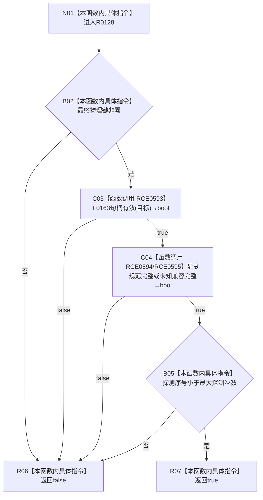

# CF-L12-0018 索引绑定请求兼容完整现状流程图

图类型：现状流程图
代码版本：`3920a74638264f9f539d50f32f3c9fe5fb1982ab`
源码 blob：`ecdd8b7888aeda86fce1ba8bc02e40b5cfa282aa`
覆盖文件：`海中鱼巣/核心/索引所有权.数据.h:102-106`
唯一根函数：R0128
完整签名：`bool 海中鱼巣::索引绑定请求::兼容完整() const noexcept`
参数：无显式参数；隐式 const `this` 为非拥有借用
返回结果：物理键、目标句柄、所有者声明和探测序号均满足兼容合同才为 `true`
已登记调用方：RCE0575
直接项目函数：RCE0593→F0163；RCE0594→R0131；RCE0595→R0135
外部边界：无；未解析项目调用：0
调用图：`流程图/主程序可达调用关系/01_main可达项目调用边表.md`
逐行映射表：`流程图/代码流程图/L12/CF-L12-0018_索引绑定请求兼容完整_逐行代码映射表.md`
验证输出：102—106 行完整映射；不得作为施工许可：是

当前边界：显式完整和未知兼容完整为 `||`；任一成立后才检查探测上界。
