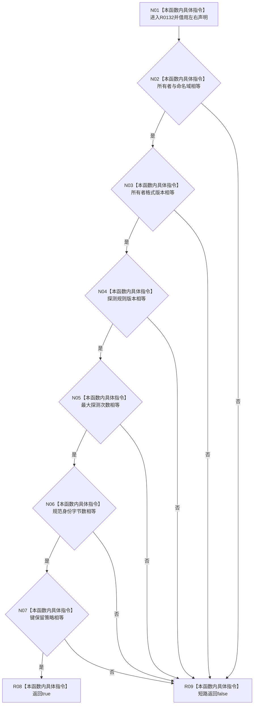

# CF-L12-0019 索引所有者声明相等现状流程图

图类型：现状流程图
代码版本：`73cc1af758e041519fa27c1dd57b9d5d07e3405a`
源码 blob：`ecdd8b7888aeda86fce1ba8bc02e40b5cfa282aa`
覆盖文件：`海中鱼巣/核心/索引所有权.数据.h:49-56`
唯一根函数：R0132
完整签名：`bool 海中鱼巣::operator==(const 海中鱼巣::索引所有者声明& 左, const 海中鱼巣::索引所有者声明& 右) noexcept`
参数：`左`、`右` 均为只读借用的索引所有者声明
返回结果：七个字段逐项相等时返回 `true`，首个不等字段短路返回 `false`
已登记调用方：RCE0592（R0127）、RCE0599（R0135）、RCE2472（R0747）
直接项目函数：无
外部边界：无；未解析项目调用：0
调用图：`流程图/主程序可达调用关系/01_main可达项目调用边表.md`
逐行映射表：`流程图/代码流程图/L12/CF-L12-0019_索引所有者声明相等_逐行代码映射表.md`
偏差清单：无
依据提交 / 结构化消息：当前源码、RCE0592、RCE0599、RCE2472
结构读取与写入：只读两个声明的全部七个字段；不写结构
逻辑内返回：任一字段不相等时返回 `false`
生命周期与资源释放：两个参数均为借用
异常：函数声明 `noexcept`
验证输出：49—56 行完整映射；3 条项目入边、0 条项目出边、0 个外部边界
不得作为施工许可：是
不得宣称：相等结果证明任何一个声明自身符合规范

## 流程图

## 当前边界

- 比较覆盖声明的全部七个字段，不执行规范有效性判断。
- 三个调用方均接收布尔比较结果；本函数不改变声明。
