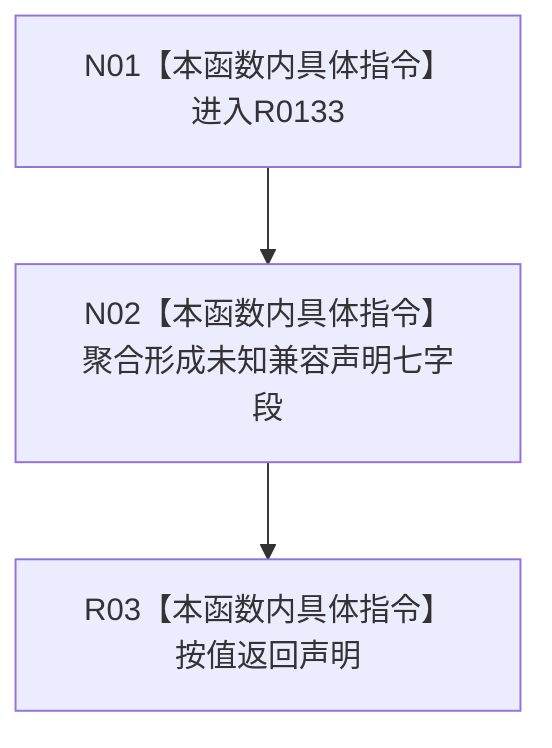

# CF-L12-0020 形成未知兼容索引所有者声明现状流程图

图类型：现状流程图
代码版本：`73cc1af758e041519fa27c1dd57b9d5d07e3405a`
源码 blob：`ecdd8b7888aeda86fce1ba8bc02e40b5cfa282aa`
覆盖文件：`海中鱼巣/核心/索引所有权.数据.h:62-64`
唯一根函数：R0133
完整签名：`inline constexpr 海中鱼巣::索引所有者声明 海中鱼巣::形成未知兼容索引所有者声明() noexcept`
参数：无
返回结果：按值返回 `{未知兼容, 0, 1, 1, 1, 0, 兼容释放}` 声明
已登记调用方：RCE0597（R0134，`索引所有权.数据.h:83`）
直接项目函数：无
外部边界：无；未解析项目调用：0
调用图：`流程图/主程序可达调用关系/01_main可达项目调用边表.md`
逐行映射表：`流程图/代码流程图/L12/CF-L12-0020_形成未知兼容索引所有者声明_逐行代码映射表.md`
偏差清单：无
依据提交 / 结构化消息：当前源码、RCE0597
结构读取与写入：仅形成返回值，不写仓库或持久结构
逻辑内返回：不适用
生命周期与资源释放：返回平凡值对象
异常：函数声明 `noexcept`
验证输出：62—64 行完整映射；1 条项目入边、0 条项目出边、0 个外部边界
不得作为施工许可：是
不得宣称：形成兼容声明等于完成索引绑定

## 流程图

## 当前边界

- 所有字段均为源码固定常量；本函数没有输入分支。
- R0134 仅在 `default` 分支调用本函数。
