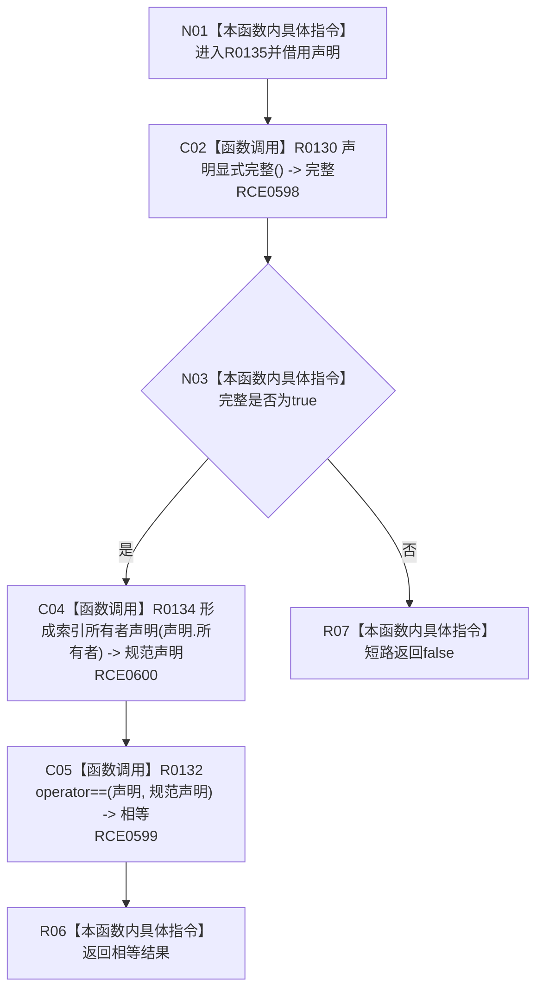

# CF-L12-0021 索引所有者声明符合规范现状流程图

图类型：现状流程图
代码版本：`73cc1af758e041519fa27c1dd57b9d5d07e3405a`
源码 blob：`ecdd8b7888aeda86fce1ba8bc02e40b5cfa282aa`
覆盖文件：`海中鱼巣/核心/索引所有权.数据.h:87-89`
唯一根函数：R0135
完整签名：`inline bool 海中鱼巣::索引所有者声明符合规范(const 海中鱼巣::索引所有者声明& 声明) noexcept`
参数：`声明` 为只读借用
返回结果：声明显式完整且与其所有者对应的规范声明逐字段相等时返回 `true`，否则返回 `false`
已登记调用方：RCE0595（R0128，`索引所有权.数据.h:104`）、RCE0602（R0136，`索引所有权.数据.h:98`）
直接项目函数：RCE0598 → R0130；RCE0600 → R0134；RCE0599 → R0132
被调函数流程图：`流程图/代码流程图/L13/CF-L13-0009_索引所有者声明显式完整_现状流程图.md`；`流程图/代码流程图/L11/CF-L11-0031_形成索引所有者声明_现状流程图.md`；`流程图/代码流程图/L12/CF-L12-0019_索引所有者声明相等_现状流程图.md`
外部边界：无；未解析项目调用：0
调用图：`流程图/主程序可达调用关系/01_main可达项目调用边表.md`
逐行映射表：`流程图/代码流程图/L12/CF-L12-0021_索引所有者声明符合规范_逐行代码映射表.md`
偏差清单：无
依据提交 / 结构化消息：当前源码、RCE0595、RCE0598、RCE0599、RCE0600、RCE0602
结构读取与写入：只读声明并形成临时规范声明；不写结构
逻辑内返回：显式完整性失败或完整声明不相等时返回 `false`
生命周期与资源释放：借用输入，规范声明为临时值
异常：函数声明 `noexcept`
验证输出：87—89 行完整映射；2 条项目入边、3 条项目出边、0 个外部边界
不得作为施工许可：是
不得宣称：返回 `true` 证明索引已经写入、绑定或发布

## 流程图

## 当前边界

- R0130 先检查显式声明基础完整性；失败时 `&&` 短路，不形成规范声明。
- R0134 依据输入声明的所有者形成完整规范值，R0132 再比较全部七个字段。
