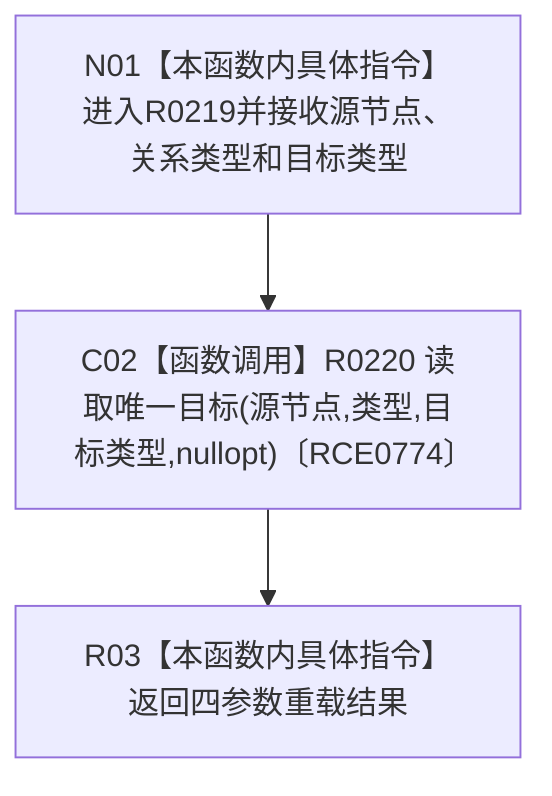

# CF-L12-0022 读取唯一目标三参数重载现状流程图

图类型：现状流程图
代码版本：`3920a74638264f9f539d50f32f3c9fe5fb1982ab`
源码 blob：`24161aaaf7138004380b42b37882149e7ff3a087`
覆盖文件：`海中鱼巣/领域/任务服务.h:734-736`
唯一根函数：R0219
完整签名：`std::optional<海中鱼巣::节点句柄> 海中鱼巣::任务服务::读取唯一目标(海中鱼巣::节点句柄 源节点, 海中鱼巣::关系类型 类型, 海中鱼巣::节点类型 目标类型) const`
参数：源节点、关系类型和目标节点类型均按值传入
返回结果：返回四参数重载在无顺序号条件下的结果
已登记调用方：RCE0749、RCE0751、RCE0753、RCE0755、RCE0761、RCE0772
直接项目函数：R0220（RCE0774）
外部边界：无；未解析项目调用：0
调用图：`流程图/主程序可达调用关系/01_main可达项目调用边表.md`
逐行映射表：`流程图/代码流程图/L12/CF-L12-0022_读取唯一目标三参数重载_逐行代码映射表.md`
偏差清单：无
依据：全部 6 条项目入边、RCE0774 与当前源码
结构读取与写入：只转发只读查询
逻辑内返回：由 R0220 决定
不得作为施工许可：是
不得宣称：唯一目标存在证明相关业务事实完成

## 流程图

## 当前边界

- 本重载只补入无顺序号条件，不自行读取关系。
