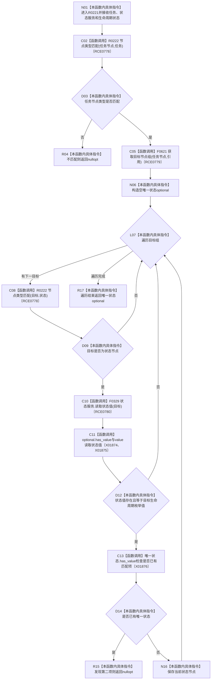

# CF-L12-0023 读取唯一任务状态现状流程图

图类型：现状流程图
代码版本：`3920a74638264f9f539d50f32f3c9fe5fb1982ab`
源码 blob：`24161aaaf7138004380b42b37882149e7ff3a087`
覆盖文件：`海中鱼巣/领域/任务服务.h:759-781`
唯一根函数：R0221
完整签名：`std::optional<海中鱼巣::节点句柄> 海中鱼巣::任务服务::读取唯一任务状态(海中鱼巣::节点句柄 任务节点, const 海中鱼巣::状态服务& 状态, 海中鱼巣::任务生命周期状态 生命周期状态) const`
参数：任务节点和生命周期状态按值传入；状态服务以 const 引用借用
返回结果：任务类型不匹配、零项或多项匹配状态时返回 `nullopt`；恰一项时返回状态节点
已登记调用方：RCE0757、RCE0759、RCE0762、RCE0773
直接项目函数：R0222（RCE0778）、F0621（RCE0779）、F0329（RCE0780）
外部边界：X01874、X01875、X01876；未解析项目调用：0
调用图：`流程图/主程序可达调用关系/01_main可达项目调用边表.md`
逐行映射表：`流程图/代码流程图/L12/CF-L12-0023_读取唯一任务状态_逐行代码映射表.md`
偏差清单：无
依据：全部 4 条项目入边、RCE0778—RCE0780、X01874—X01876 与当前源码
结构读取与写入：只读任务关系、节点类型和状态值
逻辑内返回：类型、值或唯一性不满足时返回空 optional
不得作为施工许可：是
不得宣称：状态节点存在证明任务生命周期转换合法或完成

## 流程图

## 当前边界

- 只接受类型为状态且状态值精确等于请求生命周期枚举的目标。
- 多个匹配状态不返回任一候选。
