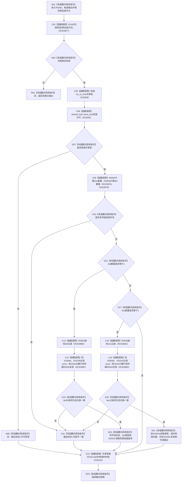

# CF-L12-0024 读取特征值侧表原始材料现状流程图

图类型：现状流程图
代码版本：`3920a74638264f9f539d50f32f3c9fe5fb1982ab`
源码 blob：`d82fa092a2c1156d2f8de758d5e32415cb64931d`
覆盖文件：`海中鱼巣/领域/参与者.特征值原始材料.ixx:244-284`
唯一根函数：R0266
完整签名：`海中鱼巣::特征值侧表原始材料快照 海中鱼巣::特征值原始材料侧表访问器::读取(海中鱼巣::节点句柄 特征值节点) const`
参数：特征值节点按值传入；通过访问器借用的 const 特征值服务读取侧表
返回结果：无效句柄返回未建立快照；锁竞争、内部不一致或唯一记录可读时返回对应状态和材料
已登记调用方：R0351（RCE1126）
直接项目函数：F0163（RCE0877）、R0554（RCE0878）、R0556（RCE0879）、R0552（RCE0880）、R0545（RCE0881）、R0548（RCE0882）、R0544（RCE0883）
外部边界：X02058—X02061、X03239—X03245；未解析项目调用：0
调用图：`流程图/主程序可达调用关系/01_main可达项目调用边表.md`
逐行映射表：`流程图/代码流程图/L12/CF-L12-0024_读取特征值侧表原始材料_逐行代码映射表.md`
偏差清单：无
依据：RCE0877—RCE0883、RCE1126、X02058—X02061、X03239—X03245 与冻结源码
结构读取与写入：在共享锁下读取侧表并构造值式快照，不写权威侧表
逻辑内返回：无效句柄、许可竞争和无记录；多记录、双表并存或记录字段异常为内部不一致
不得作为施工许可：是
不得宣称：返回快照是第二权威账或可以反向写入

## 流程图

## 当前边界

- 共享锁构造后的每条返回路径都经 X03245 析构释放锁。
- I64 快照只携带类型和版本；Vec 快照额外复制序列值。
