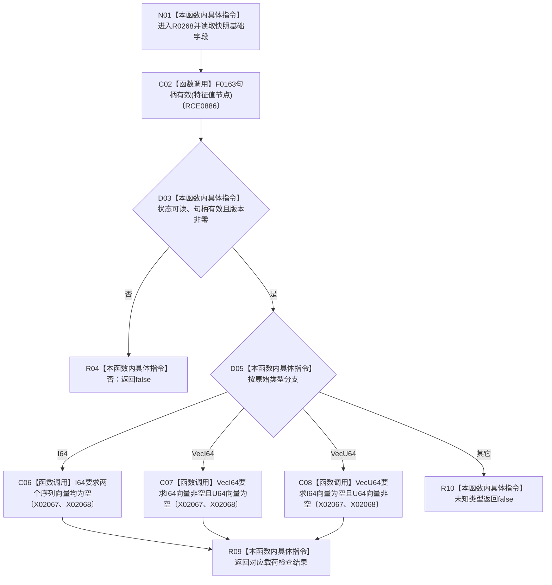

# CF-L12-0025 特征值侧表原始材料快照可读现状流程图

图类型：现状流程图
代码版本：`3920a74638264f9f539d50f32f3c9fe5fb1982ab`
源码 blob：`d82fa092a2c1156d2f8de758d5e32415cb64931d`
覆盖文件：`海中鱼巣/领域/参与者.特征值原始材料.ixx:62-69`
唯一根函数：R0268
完整签名：`bool 海中鱼巣::特征值侧表原始材料快照::可读() const`
参数：无显式参数；只读快照状态、节点、版本、类型和序列载荷
返回结果：基础字段与对应原始类型载荷形态均可读时返回 `true`，否则返回 `false`
已登记调用方：R0351（RCE1127）
直接项目函数：F0163（RCE0886）
外部边界：X02067、X02068；未解析项目调用：0
调用图：`流程图/主程序可达调用关系/01_main可达项目调用边表.md`
逐行映射表：`流程图/代码流程图/L12/CF-L12-0025_特征值侧表原始材料快照可读_逐行代码映射表.md`
偏差清单：无
依据：RCE0886、RCE1127、X02067、X02068 与冻结源码
结构读取与写入：只读快照，不改变结构
逻辑内返回：状态、句柄、版本、类型或载荷形态不匹配时返回 `false`
不得作为施工许可：是
不得宣称：对应节点记录、主信息或事务发布事实已经重新验证

## 流程图

## 当前边界

- I64 的具体标量不存入本快照，I64 可读形态要求两个序列向量为空。
