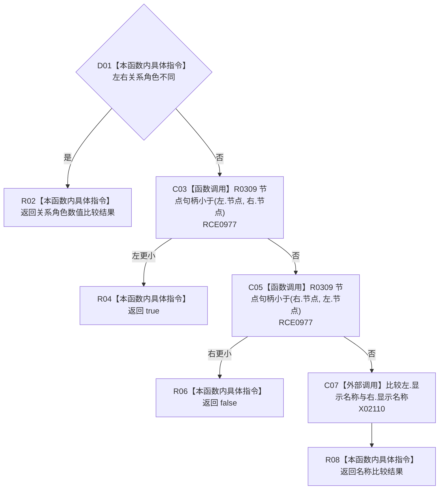

# CF-L12-0026 节点子项排序比较现状流程图

图类型：现状流程图
代码版本：`3920a74638264f9f539d50f32f3c9fe5fb1982ab`
源码 blob：`b0b4cdc2cd7e7fd6801f36c7a43bc27595ca89d9`
覆盖文件：`海中鱼巣/领域/控制面板服务.h:1663-1675`
唯一根函数：R0295
完整签名：`bool 海中鱼巣::控制面板服务::排序节点子项(海中鱼巣::控制面板树节点材料&)::<lambda@控制面板服务.h:1663>::operator()(const 海中鱼巣::控制面板树节点材料& 左, const 海中鱼巣::控制面板树节点材料& 右) const`
参数：左右树节点材料以 const 引用借用
返回结果：先按关系角色、再按节点句柄、最后按显示名称比较
已登记调用方：R0294（RCE0976；RCB0010）
直接项目函数：R0309（RCE0977，两处）
外部边界：X02110；X02109 已建议停用
逐行映射表：`流程图/代码流程图/L12/CF-L12-0026_节点子项排序比较_逐行代码映射表.md`
依据：冻结源码、RCE0976、RCE0977、RCB0010
结构读写：无，只读比较
不得作为施工许可：是
不得宣称：比较器调用 `std::sort`

## 流程图

## 当前边界

- X02109 的源码位置是外层排序注册行，真实算法调用者为 R0294 的 X02108。
