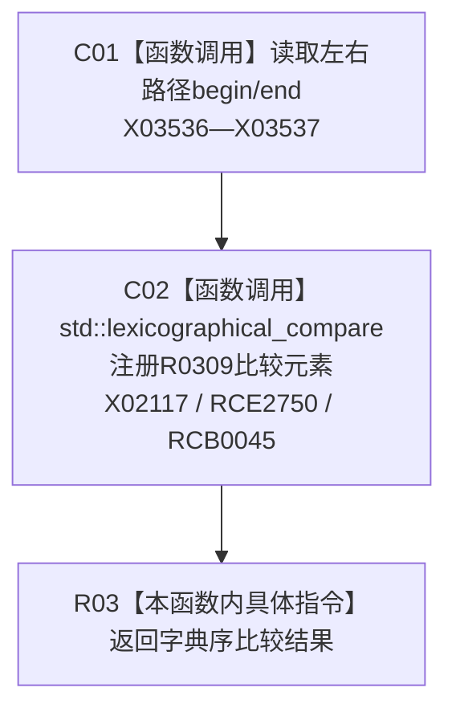

# CF-L12-0027 路径小于现状流程图

图类型：现状流程图
代码版本：`3920a74638264f9f539d50f32f3c9fe5fb1982ab`
源码 blob：`b0b4cdc2cd7e7fd6801f36c7a43bc27595ca89d9`
覆盖文件：`海中鱼巣/领域/控制面板服务.h:588-590`
唯一根函数：R0310
完整签名：`static bool 海中鱼巣::控制面板服务::路径小于(const std::vector<节点句柄>& 左, const std::vector<节点句柄>& 右)`
参数：左右节点句柄路径均为只读引用
返回结果：使用 R0309 逐元素字典序比较所得结果
已登记调用方：RCE0901（R0280）
直接项目函数：RCE2750 → R0309；外部边界：X02117、X03536—X03537；回调登记：RCB0045；未解析项目调用：0
逐行映射表：`流程图/代码流程图/L12/CF-L12-0027_路径小于_逐行代码映射表.md`
依据：冻结源码与当前正式调用关系
结构读写：无，只读两条路径
不得作为施工许可：是
不得宣称：排序关系证明路径可达或结构有效

## 流程图

## 当前边界

- X02117 只记录外层标准算法；R0309 的项目回调边与四个迭代器入口边界由 B 符号补录。
