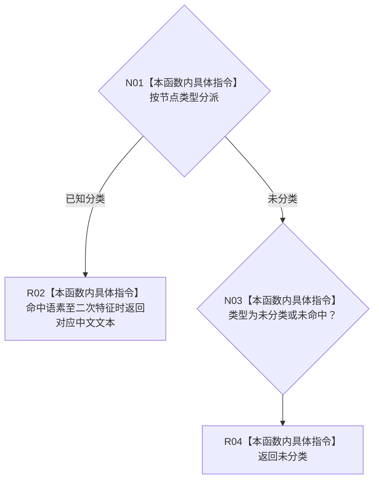

# CF-L12-0028 节点类型文本现状流程图

图类型：现状流程图
代码版本：`3920a74638264f9f539d50f32f3c9fe5fb1982ab`
源码 blob：`b0b4cdc2cd7e7fd6801f36c7a43bc27595ca89d9`
覆盖文件：`海中鱼巣/领域/控制面板服务.h:592-610`
唯一根函数：R0311
完整签名：`static const wchar_t* 海中鱼巣::控制面板服务::节点类型文本(节点类型 类型)`
参数：节点类型按值传入
返回结果：返回对应中文常量文本；未分类及未命中值返回“未分类”
已登记调用方：RCE1006（R0312）
直接项目函数：无；外部边界：无；未解析项目调用：0
逐行映射表：`流程图/代码流程图/L12/CF-L12-0028_节点类型文本_逐行代码映射表.md`
依据：冻结源码与当前正式调用关系
结构读写：无，只映射枚举到静态文本
不得作为施工许可：是
不得宣称：显示文本是节点类型权威事实

## 流程图

## 当前边界

- 文本仅供回退显示，不替代节点记录中的类型字段。
