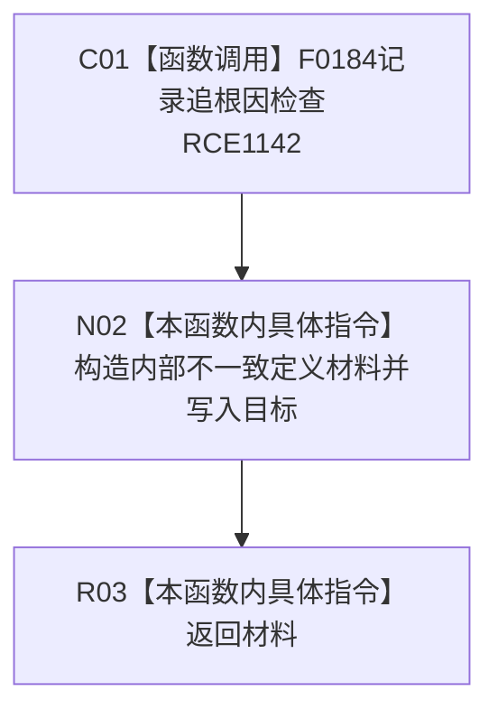

# CF-L12-0029 特征体系定义内部不一致现状流程图

图类型：现状流程图
代码版本：`3920a74638264f9f539d50f32f3c9fe5fb1982ab`
源码 blob：`a47cd9b07794d30abc6cb9d1df319056105cd596`
覆盖文件：`海中鱼巣/领域/数据操作.特征体系.ixx:1386-1392`
唯一根函数：R0354
完整签名：`海中鱼巣::特征定义值式材料 海中鱼巣::特征体系数据操作::定义内部不一致(海中鱼巣::节点句柄 目标, const wchar_t* 说明) const`
直接项目函数：RCE1142 → F0184
外部边界：无
逐行映射表：`流程图/代码流程图/L12/CF-L12-0029_特征体系定义内部不一致_逐行代码映射表.md`
不得作为施工许可：是

## 流程图

## 当前边界

- 只形成诊断返回材料，不修复定义。
