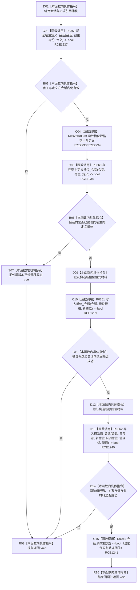

# CF-L12-0031 特征体系创建槽位发布初始状态 lambda 现状流程图

图类型：现状流程图
代码版本：`3920a74638264f9f539d50f32f3c9fe5fb1982ab`
源码 blob：`a47cd9b07794d30abc6cb9d1df319056105cd596`
覆盖文件：`海中鱼巣/领域/数据操作.特征体系.ixx:885-898`
唯一根函数：R0391
完整签名：`void 海中鱼巣::特征体系数据操作::创建槽位并发布初始状态(const 海中鱼巣::特征槽位写入规格& 槽位规格, const 海中鱼巣::初始特征值写入规格& 值规格) const::<lambda@数据操作.特征体系.ixx:885>::operator()(海中鱼巣::结构写入会话& 会话) const`
参数：`会话` 为调用期可写借用；lambda 以引用捕获外层 `宿主身份`、`定义`、`版本已经漂移`、`槽位规格`、`参与者`、`值规格`
返回结果：`void`；前置漂移或任一候选写入失败时提前返回，全部候选形成后请求提交
调用图：`流程图/主程序可达调用关系/01_main可达项目调用边表.md`
逐行映射表：`流程图/代码流程图/L12/CF-L12-0031_特征体系创建槽位发布初始状态lambda_逐行代码映射表.md`
输入契约 / 调用语境表：仅由 R0389 注册为 RCB0019；实际项目调用方为 R0102（RCE1685）
非成功返回二分审查表：版本竞争为外层可闭合逻辑结果；前置通过后的候选写入失败由执行器撤销并按内部错误收口
偏差清单：补 RCE2793、RCE2794；原 RCE1237—RCE1241 保持
依据提交 / 结构化消息：聚合关系基线 `caab8644416dea13ea598b714289d1c86ac05304`；冻结源码提交 `3920a74638264f9f539d50f32f3c9fe5fb1982ab`
验证输出：本批 Mermaid、节点双向、源码覆盖与差异格式检查
不得作为施工许可：是
不得宣称：调用 `请求提交()` 表示事务已确认、已发布或普通读取已经可见

## 流程图

## 回调、写入与生命周期边界

- R0389 在 line 885 以 RCB0019 注册本 lambda；R0103 只把 `std::function` 与单参与者转给 R0102，真正执行 `operator()` 的项目调用方是 R0102（RCE1685）。
- R0359 失败或 R0360 发现并发槽位时只改写外层局部 `版本已经漂移`，不请求提交；R0389 在事务外读回后映射为版本漂移或幂等结果。
- R0361 或 R0362 返回 false 时回调停止新增写入；会话和参与者候选由结构写入执行器统一撤销，不能把该 false 写成普通入口拒绝。
- `新槽位`、`新值` 都是回调局部值式材料；提前返回与正常返回均结束其生命周期，不使其成为事务外第二权威材料。
