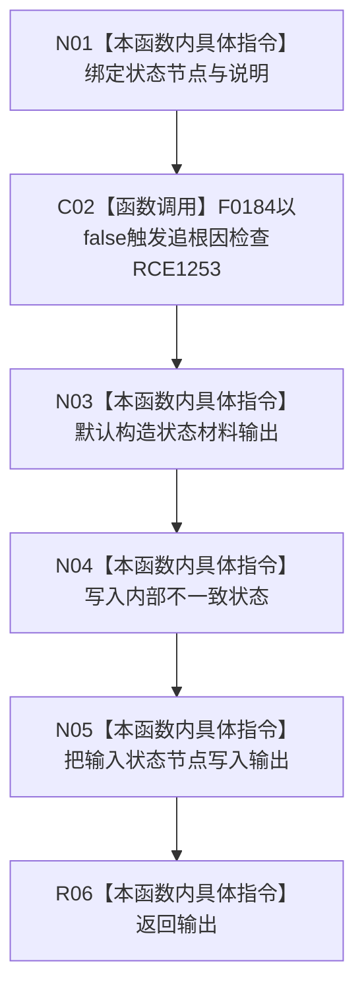

# CF-L12-0033 状态动态状态内部不一致现状流程图

图类型：现状流程图
代码版本：`3920a74638264f9f539d50f32f3c9fe5fb1982ab`
源码 blob：`cc399ea69282bf3ae0b0d59c7f0b587e5164b187`
覆盖文件：`海中鱼巣/领域/数据操作.状态动态.ixx:1325-1331`
唯一根函数：R0397
完整签名：`海中鱼巣::状态值式材料 海中鱼巣::状态动态数据操作::状态内部不一致(海中鱼巣::节点句柄 状态节点, const wchar_t* 说明) const`
参数：`状态节点` 按值传入；`说明` 为只读借用宽字符串指针，仅用于人读诊断
返回结果：返回状态为内部不一致且保留输入状态节点的值式材料
已登记调用方：R0396（RCE1248）
直接项目函数：F0184（RCE1253）
外部边界：无
逐行映射表：`流程图/代码流程图/L12/CF-L12-0033_状态动态状态内部不一致_逐行代码映射表.md`
结构读取与写入：只形成局部返回材料，不改变机器结构
不得作为施工许可：是

## 流程图

## 当前边界

- `说明` 只进入诊断调用，不承担机器事实；结构化内部不一致状态由返回材料承载。
