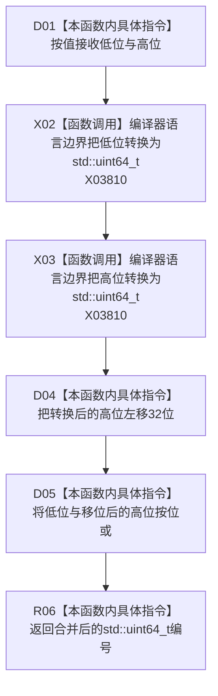

# CF-L12-0034 状态动态合并幂等编号现状流程图

图类型：现状流程图
代码版本：`3920a74638264f9f539d50f32f3c9fe5fb1982ab`
源码 blob：`cc399ea69282bf3ae0b0d59c7f0b587e5164b187`
覆盖文件：`海中鱼巣/领域/数据操作.状态动态.ixx:967-970`
唯一根函数：R0408
完整签名：`static std::uint64_t 海中鱼巣::状态动态数据操作::合并幂等编号(std::int64_t 低位, std::int64_t 高位) noexcept`
参数：`低位` 为按值传入的有符号 64 位低槽材料；`高位` 为按值传入的有符号 64 位高槽材料；本函数不持有调用方对象
返回结果：分别按 `std::uint64_t` 转换低位与高位，把高位左移 32 位后与低位按位或所得的无符号 64 位编号
已登记调用方：R0396（RCE1250）
直接项目函数：无
外部边界：X03810（两次 `static_cast<std::uint64_t>(std::int64_t)`）
逐行映射表：`流程图/代码流程图/L12/CF-L12-0034_状态动态合并幂等编号_逐行代码映射表.md`
结构读取与写入：只读取两个按值参数并执行整数转换和位运算；不读取或写入机器结构
逻辑内返回：无；全部位模式均产生一个 `std::uint64_t` 结果
内部错误边界：本函数不校验参数是否落在 32 位非负范围；当前唯一调用方 R0396 在调用前完成该范围检查
依据提交 / 结构化消息：当前维护基线 `7951b1bea78c7338643ab18428180d521e4d5a62`；冻结源码提交 `3920a74638264f9f539d50f32f3c9fe5fb1982ab`
验证输出：本批 Mermaid、节点双向、源码覆盖与差异格式检查
不得作为施工许可：是
不得宣称：返回值已与状态节点、幂等主键或仓库记录完成绑定

## 流程图

## 当前边界

- 本函数没有项目函数调用；两次 `static_cast<std::uint64_t>(std::int64_t)` 按当前聚合口径合并登记为编译器 / 语言边界 X03810，调用次数为 2。
- R0396 在第 1094—1097 行拒绝缺失、负数或超过 `0xffff'ffffULL` 的双槽材料后，才于第 1100 行经 RCE1250 调用本函数。
- 本函数自身不屏蔽超过低 32 位的位模式；离开已登记调用语境时，调用方必须自行承担参数前置。
