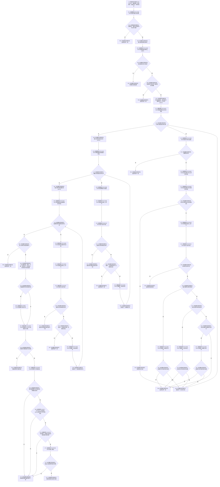

# CF-L12-0035 读取正式结算材料已许可现状流程图

图类型：现状流程图
代码版本：`3920a74638264f9f539d50f32f3c9fe5fb1982ab`
当前工作区复核基线：`fe2ca0c3e7b8f734053b87b96de65ea0f2e57b67`
源码 blob：`16ac9534baeda26ac8a712066e713f3339f6e0c8`
覆盖文件：`海中鱼巣/领域/数据操作.需求任务方法.ixx:2074-2182`
唯一根函数：R0441
完整签名：`海中鱼巣::需求任务方法读取状态 海中鱼巣::需求任务方法数据操作::读取正式结算材料_已许可(海中鱼巣::节点句柄 需求, const 海中鱼巣::需求权威材料& 需求材料, const 海中鱼巣::关系记录& 归属记录, const 海中鱼巣::结构事务令牌& 令牌, 海中鱼巣::需求正式结算材料& 输出) const`
参数：`需求` 按值传入；`需求材料`、`归属记录`、`令牌` 为调用期只读借用；`输出` 为调用方拥有的可写值式材料
返回结果：身份或当前性读取失败时传播具名读取状态；结算归属、证据角色、来源任务或输出材料不闭合时返回 `内部不一致`；全部互证通过时返回 `已找到`
调用方：R0442（RCE1371）
直接项目函数：R0436（RCE1359）、R0440（RCE1360）、R0078（RCE1361）、R0435（RCE1362）、R0437（RCE1363）、R0444（RCE1364）、F0051（RCE3007）、R0598（RCE3008）、R0840（RCE3009）、R0841（RCE3010）、R0428（RCE3011）
符号外部边界：X04054—X04068
调用图：`流程图/主程序可达调用关系/01_main可达项目调用边表.md`
外部边界表：`流程图/主程序可达调用关系/02_main可达外部边界表.md`
逐行映射表：`流程图/代码流程图/L12/CF-L12-0035_读取正式结算材料已许可_逐行代码映射表.md`
输入契约 / 调用语境表：本文“正式结算读取语境”
非成功返回二分审查表：本文“正式结算读取语境”
偏差清单：本文“当前边界与规范核对”
依据提交 / 结构化消息：冻结源码提交 `3920a74638264f9f539d50f32f3c9fe5fb1982ab`；当前 `main` 复核目标源码零差异
验证输出：109 行源码完整映射；11 个项目出边、15 个外部边界、0 个未解析项目调用；本切片不运行构建或程序
依据：`规范/0050_项目通用机器逻辑与禁止性规则总纲_20260721.md`、`规范/0600_代码函数流程图应用与维护规范.md`、`规范/3100_根规范_需求_20260720.md`、`规范/3200_根规范_任务_20260720.md`、`规范/4010_子规范_统一仓库稳定句柄与通用关系索引边界.md`、`规范/4050_子规范_入口拒绝逻辑内结果与内部逻辑错误.md`、`规范/5160_子规范_需求正式结算记录与唯一结论.md`、`规范/5210_子规范_任务状态特征集合与阶段关联_20260720.md`
不得作为施工许可：是
不得宣称：历史正式结算永久证明当前满足、任务完成等于需求结算、返回已找到发布了新结算事实、可选因果证据是必需角色，或本函数写入了需求、任务、状态、动态、关系或索引

## 流程图

## 稳定调用合同

| 边界 | 调用点 |
| --- | --- |
| RCE1359 | 2080、2097、2125、2139 |
| RCE1360 | 2085 |
| RCE1361 | 2095、2123、2137 |
| RCE1362 | 2101、2126、2140 |
| RCE1363 | 2104、2109、2114、2131、2145 |
| RCE1364 | 2171 |
| RCE3007 | 2082、2175—2178 |
| RCE3008 | 2099—2100 |
| RCE3009 | 2173 |
| RCE3010 | 2178 |
| RCE3011 | 2102、2127—2128、2141—2142 |
| X04054—X04059 | `optional<高级关系证据>` 的 `has_value`、const / 非 const 解引用、`operator->`、复制赋值与析构 |
| X04060—X04065 | 三个 `vector<关系记录>` 范围循环的 `begin`、`end`、迭代器比较 / 解引用 / 递增与析构 |
| X04066—X04068 | `optional<节点句柄>` 的值构造、`operator!=` 与析构 |

## 正式结算读取语境

| 位置 | 条件 | 二分口径 | 结构变化 |
| --- | --- | --- | --- |
| 2080—2089 | 调用方已提供正式需求材料，但归属或结算状态读回不闭合 | 内部逻辑错误，追根因解决 | 无 |
| 2092—2153 | 已读回结算状态，但必需角色缺失、重复、错序或错类型 | 内部逻辑错误，追根因解决 | 无 |
| 2166—2169 | 因果引用角色可选；存在时成对写入输出 | 合法可选材料 | 只改变调用方输出材料 |
| 2171—2179 | 来源任务不是完整已完成承接，或任务结果与结算证据不同源 | 内部逻辑错误，追根因解决 | 只改变调用方输出材料 |

## 当前边界与规范核对

- 本函数要求结算需求、来源任务、目标状态、实际状态、动态证据和可选因果引用能够双向回读；因果引用保持零或一。
- 来源任务必须完整承接同一需求、处于已完成阶段，且实际结果、场景和治理存在与结算状态同源。
- 历史正式结算材料只是只读投影；返回 `已找到` 不等于当前世界目标仍满足，也不执行价值结算。
