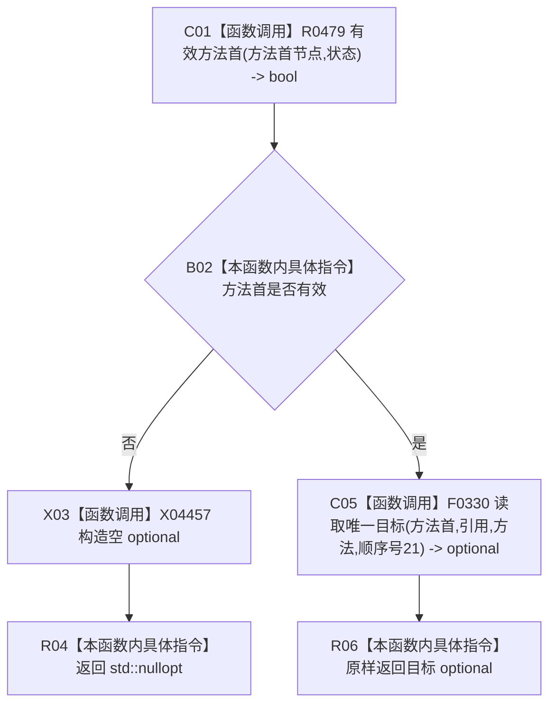

# CF-L12-0038 方法服务读取父方法现状流程图

代码版本：`3920a74638264f9f539d50f32f3c9fe5fb1982ab`
当前工作区复核基线：`af74e46ef3fd0b1b2c108d695569855909a59ee1`
源码 blob：`839dd462c70e8d54b6f22f1126d751ac9425398a`
图类型：现状流程图
覆盖文件：`海中鱼巣/领域/方法服务.h:1062-1067`
唯一根函数：R0470
完整签名：`std::optional<节点句柄> 海中鱼巣::方法服务::读取父方法(节点句柄 方法首节点, const 状态服务& 状态) const`
参数：方法首节点值传入；状态只读借用
返回结果：唯一父方法节点 optional；方法首无效或唯一目标读取为空时返回空
已登记调用方：R0473
直接项目函数：R0479（RCE1441）、F0330（RCE1442）
稳定外部边界：X04457
逐行映射表：`流程图/代码流程图/L12/CF-L12-0038_方法服务读取父方法_逐行代码映射表.md`
不得作为施工许可：是
不得宣称：父方法关系满足目标设计

## 节点合同

| 节点 | 类型 | 输入 | 输出 / 后继 |
| --- | --- | --- | --- |
| C01 / B02 | 函数调用 / 本函数内具体指令 | 方法首节点、状态 | 有效或拒绝 |
| X03 / R04 | 函数调用 / 本函数内具体指令 | 无 | 空 optional |
| C05 / R06 | 函数调用 / 本函数内具体指令 | 固定引用、方法、顺序号21 | 原样返回唯一目标结果 |

## 关键边界

- 本函数零机器事实写入；F0330 的非平凡筛选过程独立展开。
- 方法首无效和目标为空均是普通只读查询的逻辑内空结果。
