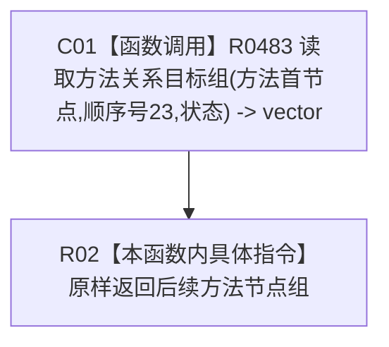

# CF-L12-0040 方法服务读取后续方法组现状流程图

代码版本：`3920a74638264f9f539d50f32f3c9fe5fb1982ab`
当前工作区复核基线：`57866ac5ca63235ed12da60f635d29f1aacd718b`
源码 blob：`839dd462c70e8d54b6f22f1126d751ac9425398a`
图类型：现状流程图
覆盖文件：`海中鱼巣/领域/方法服务.h:1091-1093`
唯一根函数：R0472
完整签名：`std::vector<节点句柄> 海中鱼巣::方法服务::读取后续方法组(节点句柄 方法首节点, const 状态服务& 状态) const`
参数：方法首节点值传入；状态只读借用
返回结果：顺序号23对应的当前方法目标节点组
已登记调用方：R0473
直接项目函数：R0483（RCE1444）
外部边界：无新增建议
逐行映射表：`流程图/代码流程图/L12/CF-L12-0040_方法服务读取后续方法组_逐行代码映射表.md`
不得作为施工许可：是
不得宣称：后续方法关系已经满足目标设计

## 节点合同

| 节点 | 类型 | 输入 | 输出 |
| --- | --- | --- | --- |
| C01 | 函数调用 | 方法首节点、后续方法顺序号23、状态 | 当前目标节点组 |
| R02 | 本函数内具体指令 | 当前目标节点组 | 值式返回 |

## 关键边界

- 本函数只是具名顺序号转发器，零结构写入。
- R0483 的非平凡内部过程应由其独立现状图承载。
