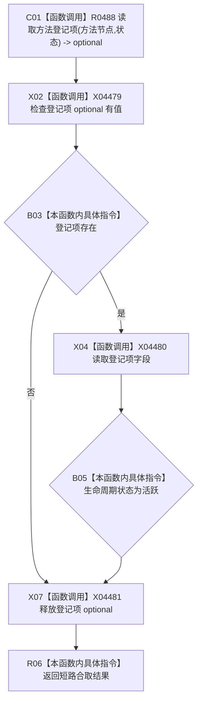

# CF-L12-0041 方法服务有效方法首现状流程图

代码版本：`0a93526882cb33c61c2fbb04ecad1aeaddcfe225`
当前工作区复核基线：`ece29318f80cad2ce7a4abce9b009c60cd4cdfdd`
源码 blob：`839dd462c70e8d54b6f22f1126d751ac9425398a`
图类型：现状流程图
覆盖文件：`海中鱼巣/领域/方法服务.h:1668-1671`
唯一根函数：R0479
完整签名：`bool 海中鱼巣::方法服务::有效方法首(节点句柄 方法节点, const 状态服务& 状态) const`
参数：方法节点值传入；状态只读借用
返回结果：读取到登记项且生命周期状态为活跃时返回 true，否则 false
调用图：入边 RCE1434、RCE1439、RCE1441、RCE1445、RCE1462、RCE1466、RCE1471、RCE1477、RCE1481、RCE1489、RCE1497；出边 RCE1461
逐行映射表：`流程图/代码流程图/L12/CF-L12-0041_方法服务有效方法首_逐行代码映射表.md`
输入契约 / 调用语境表：本图“关键边界”记录多个只读筛选调用方
非成功返回二分审查表：无显式中途返回；false 为登记项缺失或非活跃的短路结果
偏差清单：新增三个标准库 optional 外部边界建议
依据提交 / 结构化消息：冻结源码、当前调用关系与逐调用点复核
验证输出：本批不运行构建或程序
不得作为施工许可：是
不得宣称：方法生命周期模型符合现行目标设计

## 节点合同

| 节点组 | 类型 | 输入 | 结果 / 后继 |
| --- | --- | --- | --- |
| C01—B03 | 函数调用 / 本函数内具体指令 | 方法节点、状态 | 无登记项时结果 false |
| X04—B05 | 函数调用 / 本函数内具体指令 | 登记项 | 比较生命周期状态 |
| X07 / R06 | 函数调用 / 本函数内具体指令 | 局部 optional、合取结果 | 释放局部量并返回 bool |

## 关键边界

- 本函数只读登记项，不修改登记、关系或状态结构。
- 所有调用语境均把 false 用作只读筛选；函数不区分登记项缺失与生命周期非活跃。
