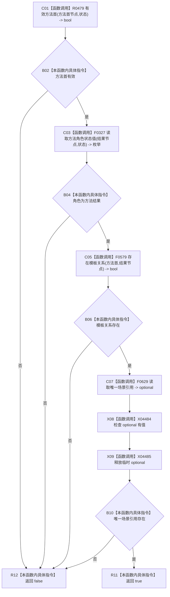

# CF-L12-0043 方法服务有效方法结果节点现状流程图

代码版本：`0a93526882cb33c61c2fbb04ecad1aeaddcfe225`
当前工作区复核基线：`ece29318f80cad2ce7a4abce9b009c60cd4cdfdd`
源码 blob：`839dd462c70e8d54b6f22f1126d751ac9425398a`
图类型：现状流程图
覆盖文件：`海中鱼巣/领域/方法服务.h:1680-1685`
唯一根函数：R0481
完整签名：`bool 海中鱼巣::方法服务::有效方法结果节点(节点句柄 方法首节点, 节点句柄 方法结果节点, const 状态服务& 状态) const`
参数：两个节点句柄值传入；状态只读借用
返回结果：方法首有效、目标角色为方法结果、模板关系存在且存在唯一场景引用时返回 true，否则 false
调用图：入边 RCE1476、RCE1495；出边 RCE1466—RCE1469
逐行映射表：`流程图/代码流程图/L12/CF-L12-0043_方法服务有效方法结果节点_逐行代码映射表.md`
输入契约 / 调用语境表：本图“关键边界”记录 R0482/R0493 的只读筛选语境
非成功返回二分审查表：无显式中途返回；任一前置失败短路 false
偏差清单：新增 F0629 临时 optional 的 has_value 与析构边界建议
依据提交 / 结构化消息：冻结源码、当前调用关系与逐调用点复核
验证输出：本批不运行构建或程序
不得作为施工许可：是
不得宣称：方法结果模型符合现行目标设计

## 节点合同

| 节点组 | 类型 | 输入 | 结果 / 后继 |
| --- | --- | --- | --- |
| C01—B06 | 函数调用 / 本函数内具体指令 | 方法首、结果节点、状态 | 任一结构前置失败即 false |
| C07—B10 | 函数调用 / 本函数内具体指令 | 结果节点的场景引用 | 检查唯一目标 optional |
| R11 / R12 | 本函数内具体指令 | 短路合取结果 | 返回 bool |

## 关键边界

- 本函数只读角色、关系和场景引用，不写机器事实。
- R0482/R0493 将 false 作为候选筛除结果；函数不报告具体失败项。
