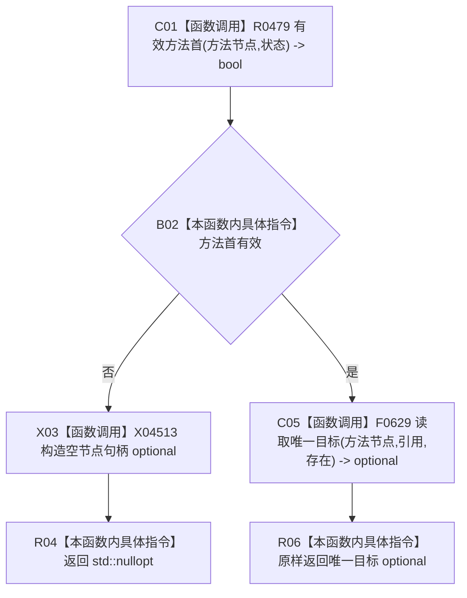

# CF-L12-0044 方法服务读取方法虚拟存在现状流程图

代码版本：`0a93526882cb33c61c2fbb04ecad1aeaddcfe225`
当前工作区复核基线：`ece29318f80cad2ce7a4abce9b009c60cd4cdfdd`
源码 blob：`839dd462c70e8d54b6f22f1126d751ac9425398a`
图类型：现状流程图
覆盖文件：`海中鱼巣/领域/方法服务.h:870-875`
唯一根函数：R0489
完整签名：`std::optional<节点句柄> 海中鱼巣::方法服务::读取方法虚拟存在(节点句柄 方法节点, const 状态服务& 状态) const`
参数：方法节点值传入；状态只读借用
返回结果：方法首无效时返回 `std::nullopt`；否则返回唯一存在引用目标 optional
调用图：入边 RCE1435；出边 RCE1489、RCE1490
逐行映射表：`流程图/代码流程图/L12/CF-L12-0044_方法服务读取方法虚拟存在_逐行代码映射表.md`
输入契约 / 调用语境表：R0468 对候选方法首读取虚拟存在节点
非成功返回二分审查表：方法首无效为空；唯一目标缺失或不唯一的空结果由 F0629 产生
偏差清单：新增空节点句柄 optional 构造边界建议
依据提交 / 结构化消息：冻结源码、当前调用关系与逐调用点复核
验证输出：本批不运行构建或程序
不得作为施工许可：是
不得宣称：虚拟存在引用满足现行目标业务合同

## 节点合同

| 节点组 | 类型 | 输入 | 结果 / 后继 |
| --- | --- | --- | --- |
| C01 / B02 | 函数调用 / 本函数内具体指令 | 方法节点、状态 | 无效方法首进入空返回 |
| X03 / R04 | 函数调用 / 本函数内具体指令 | `std::nullopt` | 返回空 optional |
| C05 / R06 | 函数调用 / 本函数内具体指令 | 方法节点、引用、存在类型 | 返回 F0629 的 optional |

## 关键边界

- 本函数只读登记状态和存在引用，不写机器事实。
- `std::nullopt` 同时覆盖方法首无效；F0629 还可能因目标缺失或不唯一返回空，但本函数不区分原因。
