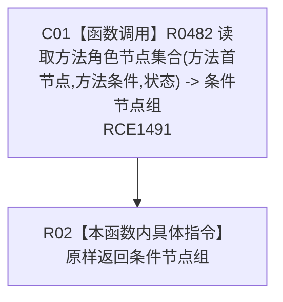

# CF-L12-0045 方法服务读取方法条件节点集合现状流程图

图类型：现状流程图
代码版本：`0a93526882cb33c61c2fbb04ecad1aeaddcfe225`
当前工作区复核基线：`ece29318f80cad2ce7a4abce9b009c60cd4cdfdd`
源码 blob：`839dd462c70e8d54b6f22f1126d751ac9425398a`
覆盖文件：`海中鱼巣/领域/方法服务.h:877-879`
唯一根函数：R0490
完整签名：`std::vector<节点句柄> 海中鱼巣::方法服务::读取方法条件节点集合(节点句柄 方法首节点, const 状态服务& 状态) const`
参数：`方法首节点` 值传入；`状态` 为调用期只读借用
返回结果：R0482 按方法条件角色筛出的当前节点组；空组为当前只读结果
已登记调用方：R0468（RCE1437）
直接项目函数：R0482（RCE1491）
外部边界：无新增建议
逐行映射表：`流程图/代码流程图/L12/CF-L12-0045_方法服务读取方法条件节点集合_逐行代码映射表.md`
不得作为施工许可：是
不得宣称：返回节点组已经满足目标业务设计或通过运行验证

## 流程图

## 节点合同

| 节点 | 类型 | 输入 | 输出 |
| --- | --- | --- | --- |
| C01 | 函数调用 | 当前对象、方法首节点、方法条件角色、状态 | 条件节点组 |
| R02 | 本函数内具体指令 | 条件节点组 | 值式返回 |

## 关键边界

- 本函数只固定方法条件角色并转发到 R0482，零结构写入。
- R0482 的角色过滤与关系读取由其独立现状图承载。
