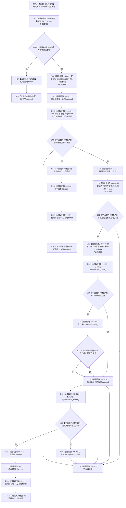

# CF-L12-0047 方法服务读取方法动作入口现状流程图

图类型：现状流程图
代码版本：`0a93526882cb33c61c2fbb04ecad1aeaddcfe225`
当前工作区复核基线：`ece29318f80cad2ce7a4abce9b009c60cd4cdfdd`
源码 blob：`839dd462c70e8d54b6f22f1126d751ac9425398a`
覆盖文件：`海中鱼巣/领域/方法服务.h:946-966`
唯一根函数：R0494
完整签名：`std::optional<节点句柄> 海中鱼巣::方法服务::读取方法动作入口(节点句柄 方法首节点, const 状态服务& 状态) const`
参数：`方法首节点` 值传入；`状态` 为调用期只读借用
返回结果：唯一有效且未失效的动作入口；方法首无效、无入口或多入口时为空 optional
已登记调用方：R0468（RCE1436）
直接项目函数：R0479（RCE1497）、F0621（RCE1498）、R0486（RCE1499）、R0487（RCE1500）
外部边界：X04516—X04529（optional 与 vector 的构造、查询、赋值、迭代及析构）
逐行映射表：`流程图/代码流程图/L12/CF-L12-0047_方法服务读取方法动作入口_逐行代码映射表.md`
不得作为施工许可：是
不得宣称：唯一入口规则已经符合目标设计或通过并发运行验证

## 流程图

## 关键边界

- 本函数只读关系、角色和入口状态；没有节点、关系、索引或状态写入。
- 无效入口和已失效入口被跳过；第二个有效未失效入口使结果退化为空 optional。
- 标准库生命周期节点只记录当前 C++ 对象边界，不表示业务事实发布。
