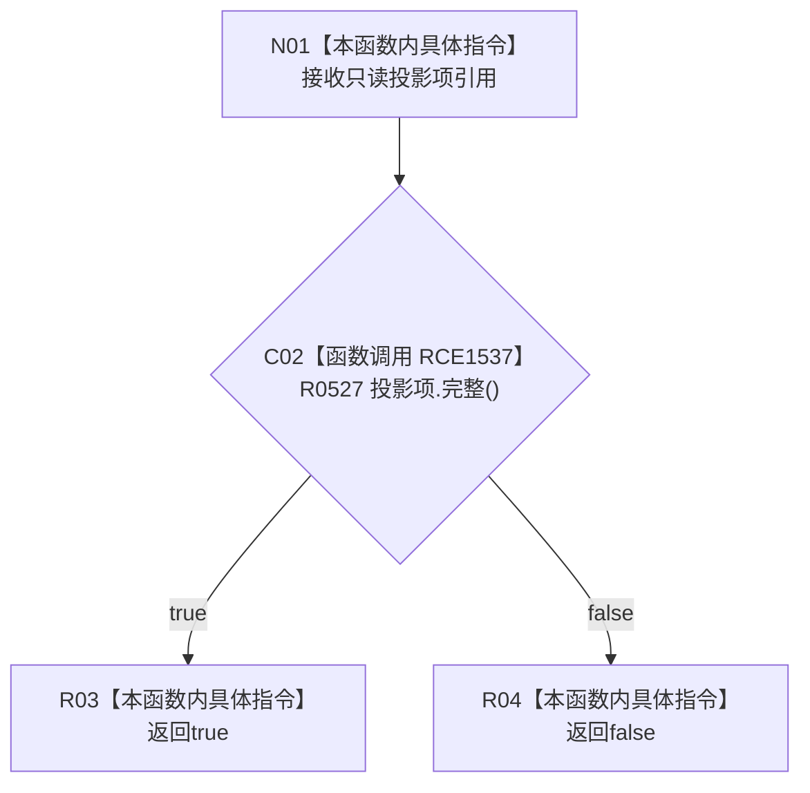

# CF-L12-0048 抽象树视图材料完整投影项回调现状流程图

图类型：现状流程图
代码版本：`0a93526882cb33c61c2fbb04ecad1aeaddcfe225`
工作区复核基线：`2089268fbb3833ebc77486169b98d8a14c49d508`
源码 blob：`dc4bd08f99622b3380c91dd15258fc8ab2e1b9c6`
覆盖文件：`海中鱼巣/领域/概念图服务.h:688-690`
唯一根函数：R0529
完整签名：`bool 海中鱼巣::抽象树视图材料::完整() const::<lambda@概念图服务.h:688>::operator()(const 海中鱼巣::抽象树投影项& 项) const`
参数：项为 `const 海中鱼巣::抽象树投影项&`，只读借用，生命周期由 X02215 的算法调用期保证
返回结果：原样返回 R0527 对当前投影项的完整性判断
已登记调用方：R0528（RCE1536；RCB0012）
直接项目函数：R0527（RCE1537）
外部边界：无；外层 `std::all_of` 属于调用方 R0528 的 X02215
逐行映射表：`流程图/代码流程图/L12/CF-L12-0048_抽象树视图材料完整投影项回调_逐行代码映射表.md`
结构读写：只读一个投影项
不得作为施工许可：是
不得宣称：单次回调成功代表全部投影项或整棵视图完整

## 流程图

## 当前边界

- 此函数只是一份标准算法回调；`std::all_of` 自身由调用方 R0528 的 X02215 表达。
- R0529 自身不调用标准库算法；它只由 R0528 经 RCE1536 / RCB0012 注册为 X02215 的项目回调。
