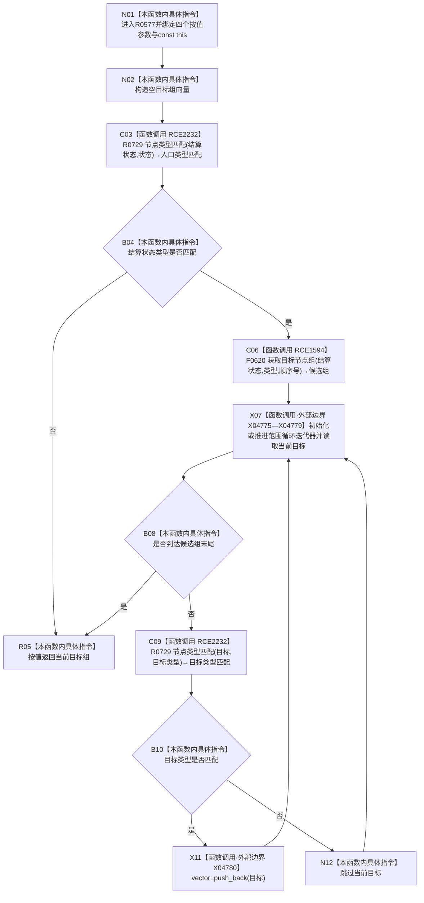

# CF-L12-0049 需求服务读取结算目标组现状流程图

图类型：现状流程图
代码版本：`03a8b7ac099ccea83e57f2696e2290b7bcdfacaf`
工作区复核基线：`7edb47f7b58aa71a10c225790e41f1d6c12a0cbd`
源码 blob：`e41b0c665b360232e55ede728f2a4d561c5c9d32`
覆盖文件：`海中鱼巣/领域/需求服务.h:1024-1036`
唯一根函数：R0577
完整签名：`std::vector<节点句柄> 海中鱼巣::需求服务::读取结算目标组(节点句柄 结算状态, 关系类型 类型, 节点类型 目标类型, std::int64_t 顺序号) const`
参数：四个显式参数均按值传入；隐式 const `this` 为调用期间有效的非拥有借用
返回结果：结算状态类型不符时返回空向量；否则返回关系目标组中类型匹配的节点句柄序列并保留读取顺序
已登记调用方：R0591（RCE1621）
直接项目函数：R0729（RCE2232，两处）、F0620（RCE1594，三参数 `关系仓库::获取目标节点组`）
外部边界：X04775—X04779 范围循环迭代操作；X04780 `vector::push_back()`
逐行映射表：`流程图/代码流程图/L12/CF-L12-0049_需求服务读取结算目标组_逐行代码映射表.md`
结构读写：只读结算状态类型及其目标关系；只写局部返回向量
逻辑内返回：结算状态类型不符或没有类型匹配目标时返回空向量
内部错误：本函数无写后异常分支
生命周期与资源释放：局部向量按值返回；范围循环引用只在迭代期间有效
不得作为施工许可：是
不得宣称：返回目标组证明结算已完成、目标互不重复或结果形成事务快照

## 流程图

## 当前边界

- F0620 的三参数无令牌重载由接收者静态类型和实参数量唯一确定。
- 目标组按关系仓库返回顺序扫描，函数不排序、不去重，也不验证候选关系的其它字段。
- 入口类型不符与过滤后无目标都返回空向量，调用方无法仅凭空向量区分两者。
