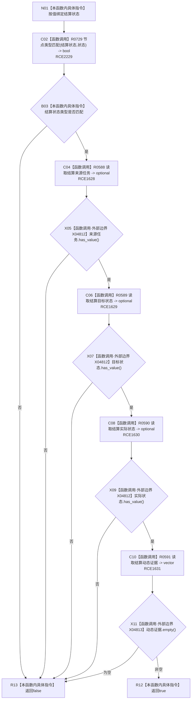

# CF-L12-0050 结算记录完整现状流程图

图类型：现状流程图
代码版本：`03a8b7ac099ccea83e57f2696e2290b7bcdfacaf`
当前工作区复核基线：`7edb47f7b58aa71a10c225790e41f1d6c12a0cbd`
源码 blob：`e41b0c665b360232e55ede728f2a4d561c5c9d32`
覆盖文件：`海中鱼巣/领域/需求服务.h:978-984`
唯一根函数：R0596
完整签名：`bool 海中鱼巣::需求服务::结算记录完整(节点句柄 结算状态) const`
参数：`结算状态` 按值输入
返回结果：结算状态类型匹配，且来源任务、目标状态、实际状态均有值并至少存在一个动态证据时返回 `true`，否则返回 `false`
已登记调用方：R0587（RCE1617）
直接项目函数：R0729（RCE2229）、R0588（RCE1628）、R0589（RCE1629）、R0590（RCE1630）、R0591（RCE1631）
外部边界：X04812（三个 optional `has_value` 调用）；X04813（vector `empty`）
逐行映射表：`流程图/代码流程图/L12/CF-L12-0050_结算记录完整_逐行代码映射表.md`
结构读写：只读节点和关系，不修改项目结构
不得作为施工许可：是
不得宣称：完整性为 `false` 时已定位缺失字段，或完整结算记录已经通过运行验证

## 流程图

## 当前边界

- 五项条件按源码 `&&` 顺序短路；前项失败时不会读取后续结算关系。
- 完整性只要求动态证据组非空，不检查动态证据内部类型、唯一性或因果引用。
- 三次 optional 判有值共享稳定边界 X04812；动态证据组判空使用 X04813。
