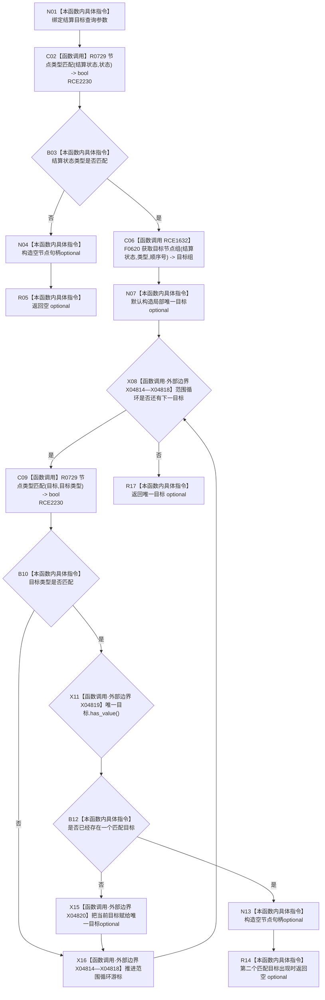

# CF-L12-0051 读取唯一结算目标现状流程图

图类型：现状流程图
代码版本：`03a8b7ac099ccea83e57f2696e2290b7bcdfacaf`
当前工作区复核基线：`7edb47f7b58aa71a10c225790e41f1d6c12a0cbd`
源码 blob：`e41b0c665b360232e55ede728f2a4d561c5c9d32`
覆盖文件：`海中鱼巣/领域/需求服务.h:986-1003`
唯一根函数：R0597
完整签名：`std::optional<节点句柄> 海中鱼巣::需求服务::读取唯一结算目标(节点句柄 结算状态, 关系类型 类型, 节点类型 目标类型, std::int64_t 顺序号) const`
参数：结算状态、关系类型、目标类型和顺序号均按值输入
返回结果：结算状态类型有效且目标组内恰有一个目标类型匹配时返回该句柄；否则返回空 optional
已登记调用方：R0588（RCE1618）、R0589（RCE1619）、R0590（RCE1620）、R0592（RCE1622）
直接项目函数：R0729（RCE2230）、F0620（RCE1632，三参数无令牌目标组重载）
外部边界：X04814—X04818（范围循环迭代操作）；X04819（optional `has_value`）；X04820（optional 赋值）
逐行映射表：`流程图/代码流程图/L12/CF-L12-0051_读取唯一结算目标_逐行代码映射表.md`
结构读写：只读节点与关系，仅修改局部 optional 和循环游标
不得作为施工许可：是
不得宣称：空 optional 已区分非法结算状态、无匹配目标和多个匹配目标

## 流程图

## 当前边界

- 非目标类型关系目标被跳过；第二个类型匹配目标会使函数立即返回空 optional。
- RCE1632 已按三实参静态重载绑定 F0620；范围循环和 optional 成员调用由 X04814—X04820 稳定登记。
- `std::nullopt` 返回与局部 optional 默认构造作为本函数内构造指令表达，不伪造外部调用。
