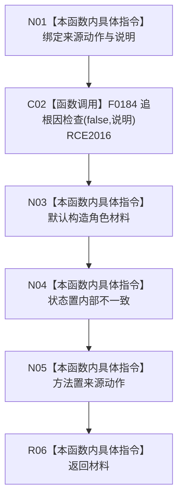

# CF-L12-0052 来源动作内部不一致现状流程图

图类型：现状流程图
代码版本：`03a8b7ac099ccea83e57f2696e2290b7bcdfacaf`
当前工作区复核基线：`f19e4b0e001554d25b1cf0847dbcfb0b52d4e22c`
源码 blob：`cc399ea69282bf3ae0b0d59c7f0b587e5164b187`
覆盖文件：`海中鱼巣/领域/数据操作.状态动态.ixx:1341-1347`
唯一根函数：R0672
完整签名：`海中鱼巣::来源动作角色材料 海中鱼巣::状态动态数据操作::来源动作内部不一致(海中鱼巣::节点句柄 来源动作, const wchar_t* 说明) const`
参数：来源动作按值输入；说明为只读诊断指针
返回结果：内部不一致状态并保留方法节点
已登记调用方：R0670（RCE2010）；直接项目函数：F0184（RCE2016）；外部边界：无
调用图：`流程图/主程序可达调用关系/00_main可达函数身份表.md`、`01_main可达项目调用边表.md`、`02_main可达外部边界表.md`
逐行映射表：`流程图/代码流程图/L12/CF-L12-0052_来源动作内部不一致_逐行代码映射表.md`
输入契约 / 调用语境表：本图内嵌审查；无独立文件
非成功返回二分审查表：本图内嵌审查；本函数只形成内部不一致材料并触发追根因检查
偏差清单：无独立文件；本批只记录当前代码事实
依据提交 / 结构化消息：冻结源码提交 `03a8b7ac099ccea83e57f2696e2290b7bcdfacaf` 与正式稳定边表
验证输出：Mermaid / 节点集合 / 逐行覆盖 PASS；目标 no-index 与全仓 diff 检查 PASS；strict 108/108 PASS；未构建、未运行
不得作为施工许可：是
不得宣称：诊断调用已经修复错误

## 流程图

## 当前边界

- 诊断文本不参与机器结果裁决。
