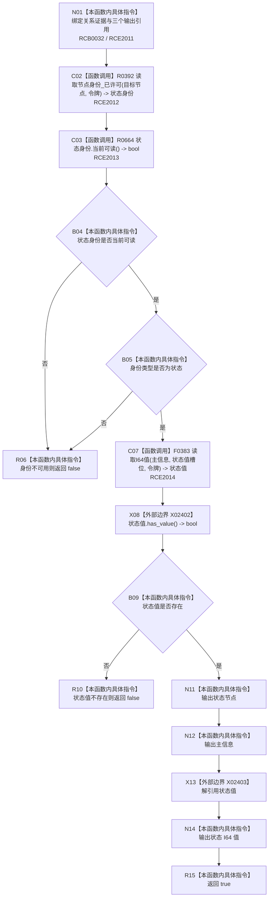

# CF-L12-0053 读取来源动作模板状态 lambda 现状流程图

图类型：现状流程图
代码版本：`03a8b7ac099ccea83e57f2696e2290b7bcdfacaf`
当前工作区复核基线：`9128ad4375a977d2744b00fcd6f9788d73b4aa7d`
源码 blob：`cc399ea69282bf3ae0b0d59c7f0b587e5164b187`
覆盖文件：`海中鱼巣/领域/数据操作.状态动态.ixx:1180-1190`
唯一根函数：R0679
完整签名：`bool 海中鱼巣::状态动态数据操作::读取来源动作角色_已许可(海中鱼巣::节点句柄, const 海中鱼巣::结构事务令牌&) const::<lambda@数据操作.状态动态.ixx:1180>::operator()(const 海中鱼巣::关系值式证据& 关系证据, 海中鱼巣::节点句柄& 状态节点, 海中鱼巣::主信息句柄& 主信息, std::int64_t& 值) const`
参数：`关系证据` 为只读引用；`状态节点`、`主信息`、`值` 为非拥有输出引用；lambda 捕获 `this` 与只读事务令牌
返回结果：身份当前可读、类型为状态且状态值存在时写出三项材料并返回 true，否则不完成输出并返回 false
调用图：`流程图/主程序可达调用关系/01_main可达项目调用边表.md`
逐行映射表：`流程图/代码流程图/L12/CF-L12-0053_读取来源动作模板状态lambda_逐行代码映射表.md`
输入契约 / 调用语境表：本图“当前边界”节；未另建独立表
非成功返回二分审查表：身份不可读、类型不匹配或状态值不存在均返回 false，由 R0670 将模板读取失败收口
偏差清单：无 / 不适用；本图只登记当前实现事实
依据提交 / 结构化消息：源码冻结 `03a8b7ac099ccea83e57f2696e2290b7bcdfacaf`；无结构化执行消息
验证输出：配对逐行映射、节点集合、源码 blob 与本批机械审计
已登记调用方：R0670（RCE2011）；注册与直接调度关系 RCB0032
直接项目函数：R0392、R0664、F0383（RCE2012—RCE2014）
外部边界：X02402、X02403（检查并解引用可选状态值）
结构读写：在同一事务令牌下只读身份与主信息值；成功时仅写调用方提供的三个输出变量
不得作为施工许可：是
不得宣称：false 一定是允许的入口拒绝、输出引用在失败时已被清空，或读取结果已经过运行验证

## 流程图

## 当前边界

- R0670 在两份必需模板关系证据上直接调用该 lambda，第二次调用受第一次返回 true 的短路条件约束。
- false 只表示本次模板状态材料未完整读出；具体应作入口拒绝还是内部不一致，由拥有完整调用语境的 R0670 裁决。
