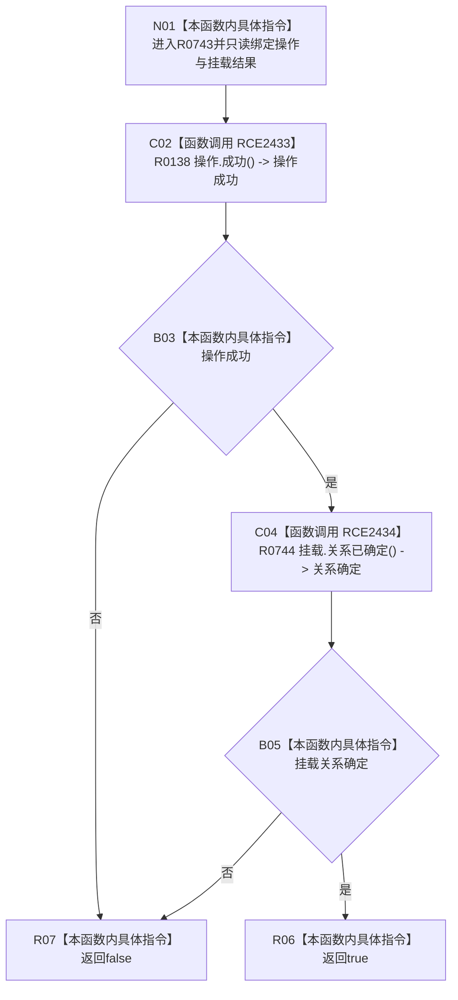

# CF-L12-0054 结构化节点挂载结果成功现状流程图

图类型：现状流程图
代码版本：`03a8b7ac099ccea83e57f2696e2290b7bcdfacaf`
当前工作区复核基线：`8632fb891fb3beea255aff1946c07b0fe975ef2b`
源码 blob：`0628ee4ade067238e826b26753d806c05b507764`
覆盖文件：`海中鱼巣/核心/关系仓库.h:175-177`
唯一根函数：R0743
完整签名：`bool 海中鱼巣::结构化节点挂载结果::成功() const noexcept`
参数：无显式参数；只读当前结果的 `操作` 与 `挂载`
返回结果：结构写入操作成功且挂载关系已确定时返回 `true`，否则返回 `false`
调用图：`流程图/主程序可达调用关系/00_main可达函数身份表.md`、`01_main可达项目调用边表.md`、`02_main可达外部边界表.md`
已登记调用方：R0024
直接项目函数：R0138（RCE2433）、R0744（RCE2434）
外部边界：无
逐行映射表：`流程图/代码流程图/L12/CF-L12-0054_结构化节点挂载结果成功_逐行代码映射表.md`
输入契约 / 调用语境表：本图内嵌审查；结构写入会话查询已形成的挂载结果
非成功返回二分审查表：本图内嵌审查；`false` 表示操作或挂载关系未共同满足成功条件
偏差清单：无独立文件；本批只记录当前代码事实
依据提交 / 结构化消息：冻结源码提交 `03a8b7ac099ccea83e57f2696e2290b7bcdfacaf` 与正式身份、调用边表
验证输出：Mermaid / 节点集合 / 逐行覆盖 PASS；目标 no-index 与全仓 diff 检查 PASS；strict 108/108 PASS；未构建、未运行
不得作为施工许可：是
不得宣称：返回 `true` 已证明能力载荷、关系仓库或业务终态完成独立验收

## 流程图

## 当前边界

- 本函数不读取 `能力` 可选值；成功分类只由操作与挂载两个子结果组成。
