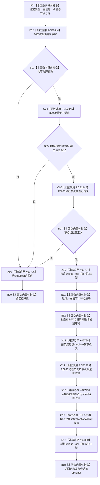

# CF-L12-0055 节点仓库创建节点未发布候选现状流程图

图类型：现状流程图
代码版本：`03a8b7ac099ccea83e57f2696e2290b7bcdfacaf`
当前工作区复核基线：`ef4f7bda76c92c0eb11456cfa267d76f35810616`
源码 blob：`f38b979a3f7cefd182a50e0b687c5a6fffebc91c`
覆盖文件：`海中鱼巣/核心/节点仓库.cpp:109-123`
唯一根函数：R0746
完整签名：`std::optional<海中鱼巣::节点未发布候选> 海中鱼巣::节点仓库::创建节点未发布候选(海中鱼巣::节点类型 类型, 海中鱼巣::主信息句柄 主信息, const 海中鱼巣::结构事务令牌& 令牌)`
参数：`类型`、`主信息` 按值输入；`令牌` 为只读非拥有借用；隐式 `this` 为调用期间有效的节点仓库
返回结果：入口复核失败时返回 `std::nullopt`；成功时在独占锁内插入版本1的有效节点记录，并返回处于未发布阶段的节点候选
调用图：`流程图/主程序可达调用关系/01_main可达项目调用边表.md`
逐行映射表：`流程图/代码流程图/L12/CF-L12-0055_节点仓库创建节点未发布候选_逐行代码映射表.md`
输入契约 / 调用语境表：当前唯一调用方 R0745 已完成独占令牌、类型和主信息复核；本函数再次执行共享令牌、主信息和类型复核
非成功返回二分审查表：当前唯一调用语境已保证前置有效，因此第116行空候选由 R0745 解释为内部不一致，按追根因解决登记
偏差清单：无 / 不适用；本图只登记当前实现事实
依据提交 / 结构化消息：源码冻结 `03a8b7ac099ccea83e57f2696e2290b7bcdfacaf`；稳定身份 R0893、边 RCE3329/RCE3330 和边界编号由顶层图谱维护收口裁决
验证输出：配对逐行映射、节点集合、源码 blob 与本批机械审计
已登记调用方：R0745（RCE2442）
直接项目函数：F0632（RCE2444）、R0009（RCE2445）、F0625（RCE2446）、R0893（RCE3329）、R0892（RCE3330）
外部边界：X02796、X02797、X02798、X02799、X02800
结构读写：独占锁内递增节点编号和创建序号，并向 `节点表_` 插入有效节点记录；尚未执行候选确认或发布
不得作为施工许可：是
不得宣称：返回候选已经确认、发布，或第116行空结果是允许忽略的普通业务空值

## 流程图

## 当前边界

- 第113—115行按短路顺序复核；前项失败时不会调用后项，也不会取得仓库锁。
- R0893 是私有三参构造，先形成未发布候选临时量；X02799 构造 optional 时经 R0892 移动构造其所含候选。
- 候选对象的平凡隐式析构不建立项目函数身份；X02800 只表达锁生命周期结束。
